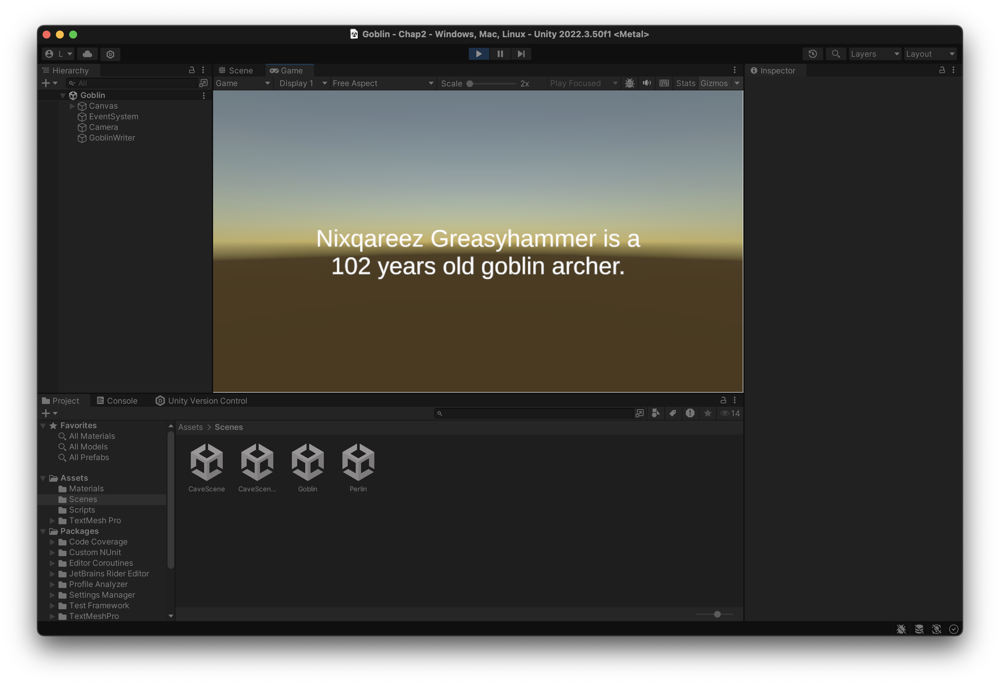

# E4FI 1I 2k24/25 - TDs et Projet - EDMEE Léon & DELMAS Denis

# Chapitre 2

- TD 1 Implémentation d'un simple générateur de noms de gobelin
    - But du TD
        - Implémenter un générateur de noms de gobelins
        - Utiliser un modèle algorithmique basé sur la structure des noms de gobelins existants.
        - Créer des noms uniques en combinant syllabes et éléments des noms de famille de manière procédurale.
        - Créer et utiliser un script pour l'affichage des noms, de l’âge et le métier
        
    
    
    
    
    
    Le code fonctionne bien, à chaque chargement de la scène un Gobelin est généré avec son nom, prénom, son âge et son métier.
    
- TD 2 Bruit de perlin
    
    
    
    
    
    Ici nous avons changé certains paramètres du Script Perlin Texture
    
- TD 3 Génération de grotte
    
    
    
    Carte initiale
    
    
    
    La grotte générée avec un seed (graine) personnalisé
    
    
    
    Grotte avec des dimensions et un seed personnalisé
    
    Question : Comment équilibreriez-vous la qualité visuelle et l'efficacité computationnelle ?
    
    Il y a plusieurs pistes : 
    
    - On pourrait déjà ne pas générer la noise map puis la grotte mais utiliser une noise map statique qui aura été générée préalablement. Cela déplace la complexité et le temps de calcul dû à la génération de la noise map à un seul moment. Cela permet aussi de garder en qualité voire d’en gagner.

# Chapitre 3

- TD 1 Le mont Fuji
    
    
    
    Etape 2 : Le terrain nouvellement créé
    
    
    
    Import de l’image de référence et début du maniement du terrain
    
    
    
    Terrassement du mont fuji terminé terminé
    
    
    
    Début du texturing du mont fuji et de ses alentours !
    
    
    
    Les arbres et la végétation ont été ajoutés avec évidemment très peu de végétation en haut
    
    
    
    La photo retirée et l’eau ajoutée
    
    
    
    La scène finale
    
- TD 2 Génération procédurale d’un terrain
    
    
    
    La capsule et la caméra première personne
    
    
    
    Le script MakeTerrain.cs
    
    
    
    Le Script MakeTerrain.cs attaché au Plan qui a son MeshCollider désactivé
    
    Etape 6 :
    
    
    
    Une fois lancé et en mode scène on a bien un terrain avec des hauteurs aléatoires
    
    
    
    En changeant la borne supérieure du Range à 50 on a effectivement bien un terrain très dentelé
    
    Etape 7 :
    
    
    
    Etape 8:
    
    
    
    En changeant le Random.Range par la fonction sinus on a efectivement des montées et des descentes plus lisses
    
    Etape 9 : 
    
    
    
    Le fichier PerlinNoise nouvellement créé.
    
    Etape 10:
    
    
    
    Le fichier MakeTerrain.cs modifié
    
    
    
    Voici le résultat 
    
    ### Questions
    
    1. **Expliquez le principe de la génération procédurale de terrains dans les environnements 3D. Comment les algorithmes de génération procédurale contribuent-ils à la diversité et à l'immersion des mondes virtuels ?**
    
    Les algorithmes de génération procédurale contribuent à la diversité et à l’immersion des mondes virtuels tout simplement car ils permettent de générer une quantité infinie de monde virtuels différents. Ainsi à chaque partie le joueur pourra jouer sur une toute nouvelle carte qui gardera des aspects cohérents mais qui sera totalement différente. 
    
    Nous pouvons penser à Minecraft avec un nombre infini de mondes possibles grâce à sa génération de monde procédurale. Les joueurs ne se lassent donc pas de jouer car chaque partie sera différente. Cela oppose les jeux avec des cartes crées à la main tel que Satisfactory. 
    
    **2.Comment le bruit de Perlin est-il appliqué dans la génération procédurale de terrains, et
    quels sont les avantages de cette méthode par rapport aux méthodes traditionnelles de
    génération de terrains ?**
    
    Le bruit de Perlin est une fonction mathématique qui produit des motifs aléatoires mais cohérents c’est pour cela qu’il est utilisé pour générer des mondes de manière procédurale. Sa force majeure est qu’il produit des motifs cohérents et continus, ce qui donne aux terrains générés un aspect naturel et réaliste et c’est ce qui est évidemment recherché pour les mondes dans les jeux vidéos.
    
    **3.Quels sont les principaux avantages de la génération procédurale de terrains dans le développement de jeux vidéo et la simulation environnementale ?**
    
    Les principaux avantages sont : 
    
    - Un gain de temps: Plutôt que de devoir faire des mondes à la main il faut juste écrire une fois l’algorithme de génération des mondes qui pourra donc mener à la génération infinie de mondes différents
    - Un gain d’argent : Car le temps c’est de l’argent dans le développement
    - Un gain de main d’oeuvre : Les artistes 2D et 3D peuvent se consacrer à la création d’assets par Example plutôt que de passer du temps à faire le monde à la main
    - Un potentiel infini : Vu que les mondes et les terrains peuvent être générés de manière procédurale alors il est possible de générer une infinité de monde en extrêmement peu de temps
    
    **4.En quoi la génération procédurale de terrains peut-elle être considérée comme avantageuse
    en termes de temps de développement et de coûts par rapport à la modélisation manuelle
    des terrains ?**
    
    Comme dit précédemment, la génération procédurale de terrains offre un avantage considérable en termes de temps et de coûts par rapport à la création manuelle de terrain. Elle permet de créer rapidement des terrains variés et d'automatiser leur création. Cela réduit significativement le temps de développement et les artistes/développeur nécessaires pour la création de terrain
    
    **5. Évaluez le temps nécessaire pour créer un terrain avec une méthode procédurale contre une méthode de modélisation manuelle pour un projet de jeu spécifique. Quels critères utiliseriez-vous pour cette évaluation ?**
    
    Critères qui seraient utilises :
    
    1. **Rejouabilité** : Si le jeu doit être rejouable à l’infini (style bac à sable) alors il serait utile d’avoir une création de terrain procédurale. Sinon il serait plus rapide de créer le monde manuellement (Satisfactory)
    2. **Complexité et taille du terrain** : Un terrain complexe et/ou grand serait plus rapide à créer de manière procédurale.
    3. **Modification :** Si le terrain ne doit pas être modifié, la modélisation manuelle peut être suffisante.
    4. **Budget** : La génération procédurale réduit considérablement le temps de développement.
    
    **6.Discutez des limitations du bruit de Perlin classique dans la génération procédurale de
    terrains. Comment les variantes améliorées du bruit de Perlin, telles que le bruit Simplex,
    adressent-elles ces limitations ?**
    
    Limitations du bruit de Perlin classique :
    
    - **Artefacts visuels,**
    - **Anisotropie**
    
    Le bruit Simplex réduit ces artefacts en utilisant une structure plus simple et moins de calculs, offrant des terrains plus lisses et réalistes avec des performances optimisées pour les grandes surfaces.
    
- TD 3 Génération procédurale de villes
    
    
    
    Etapes 1,2,3 : Création du personnage et du plane
    
    
    
    Etape 4 : Création de Makecity
    
    
    
    Etape 5: Voilà ce qu’on a comme terrain avec le script du TD2 dans MakeCity (ici on a gardé le fichier MakeTerrain)
    
    
    
    
    
    
    
    Etape 6 : Effectivement les valeurs sont bien entre -4 et 4
    
    
    
    Etape 7 : Les bâtiments ont étés ajoutés au projet
    
    
    
    Etape 8 : Les bâtiments ont étés ajoutés à la Scène et redimensionnés/pivotés
    
    
    
    Etape 9 : Création des Préfabriques
    
    
    
    Etape 10 : Remplacement du script MakeCity (déjà fait auparavant)
    
    [https://www.notion.so](https://www.notion.so)
    
    
    
    Etape 11 : Paramétrages du script MakeCity avec les préfabs
    
    
    
    Etape 12 : La ville générée
    
    **Questions**
    
    1. **Théorique : Expliquez les principes de base de la génération procédurale de villes dans les jeux vidéo.
    Quelles sont les techniques couramment utilisées pour créer des villes qui semblent
    crédibles et vivantes ?**
    
    Comme déjà expliqué dans le TD précédent, la génération procédurale de villes et/ou de terrains consiste à créer des environnements de manière algorithmique (procédurale), plutôt que de les créer à la main. Cela permet de générer une quantité infinie de villes et de mondes uniques en réduisant le temps de développement.
    
    Les principes de base de la génération procédurale de villes reposent sur plusieurs éléments clés :
    
    1. Structure urbaine hiérarchique :
    - Réseau routier principal
    - Découpage en quartiers
    - Placement des bâtiments
    - Distribution des espaces verts
    1. Techniques couramment utilisées :
    - L-systems pour la génération de routes
    - Agents autonomes pour simuler la croissance urbaine
    - Grammaires de forme pour les bâtiments
    - Bruit de Perlin pour la variation naturelle
    
    Pour créer des villes qui semblent uniques et vivantes on utilise le Bruit de Perlin pour le terrain mais on peut aussi l’utiliser pour le placement des bâtiments. On peut même combiner deux noise maps différentes avec une pour le terrain et une pour le placement des objets/bâtiments.
    
    **1.1 Pratique : Décrivez une méthode pour mettre en œuvre la génération procédurale d'une petite ville
    dans Unity, en utilisant le bruit de Perlin pour déterminer la distribution des bâtiments. Quels
    paramètres ajusteriez-vous pour influencer la densité et la variété des structures générées ?**
    
    **Description**
    
    1. Créer un projet Unity avec un plane et une capsule (comme on l’a fait jusqu’ici)
    2. Utiliser le bruit de Perlin pour déterminer des points de hauteur sur le terrain.
    3. Importer des modèles de bâtiments et créer des préfabriqués pour chaque modèle.
    4. Positionner les bâtiments en fonction des valeurs de hauteur générées par le bruit de Perlin.
    
    **Paramètres à ajuster pour influencer la densité et la variété :**
    
    - **Fréquence du bruit**  : Une fréquence plus élevée crée des variations plus rapides dans le bruit
    - **Frequence de spawn des bâtiments** : En réduisez la densité de bâtiments on peut créer des zones plus ou moins vide
    - **Graine (seed)** : Comme dans certaines jeux (Minecraft) avoir la possibilité de mettre un seed permettrait au joueur de retrouver un monde identique et de facilement en générer un totalement aléatoire
    - **Amplitude** : Contrôle l'influence du bruit sur les caractéristiques des bâtiments, comme la hauteur.
    - **Tableau de préfabriqués** : Plus de variété dans les bâtiments améliore le réalisme. Au lieu d’en faire un prefab par batiment on pourrait créer des ilots différents
    
    **2.Théorique :Pourquoi la génération procédurale de villes, en particulier avec l'utilisation du bruit de
    Perlin, est-elle avantageuse dans le développement de jeux vidéo ? Quels aspects de la création de jeu bénéficient le plus de cette approche ?**
    
    *Pourquoi la génération procédurale de villes, en particulier avec l'utilisation du bruit de
    Perlin, est-elle avantageuse dans le développement de jeux vidéo ?* 
    
    L'utilisation du bruit de Perlin permet une répartition naturelle et réaliste des bâtiments et des hauteurs. La génération procédurale permet également une réutilisation du code pour créer divers environnements, ce qui accélère le développement.
    
    Du coup, comme déjà dit dans d’autres TDs on gagne beaucoup en ressources financières et humaines ainsi qu’en ressources temporelles (temps)
    
    *Quels aspects de la création de jeu bénéficient le plus de cette approche ?*
    
    - **Exploration :** Les villes générées procéduralement offrent des environnements vastes et variés à explorer, incitant les joueurs à découvrir de nouveaux lieux et à vivre de nouvelles expériences.
    - **Rejouabilité :** Chaque partie d'un jeu avec des villes générées procéduralement est unique
    - **Adaptation aux différents genres :** La génération procédurale peut être utilisée pour créer des villes adaptées à différents genres de jeux, des RPG aux jeux d'action en passant par les jeux de simulation .
    
    **2.2. Pratique : Proposez une technique optimisée utilisant le bruit de Perlin pour varier l'altitude des
    terrains urbains dans un système de génération procédurale de villes. Comment cette variation d'altitude peut-elle enrichir l'expérience de jeu ?**
    
    Une optimisation pour varier l’altitude des terrains pourrait inclure l’ajout de couches supplémentaires de bruit de Perlin, créant ainsi des pentes et collines plus réalistes. En ajustant la fréquence du bruit, on peut rendre certaines zones plus montagneuses d'autres plates. 
    
    Cela enrichit le gameplay en offrant une topographie variée, influençant la disposition des bâtiments et les types de structures à utiliser.
    
    **3. Théorique : La génération procédurale de villes peut-elle toujours respecter le réalisme et la cohérence
    des environnements urbains ? Quels sont les défis principaux à surmonter pour maintenir ce réalisme ?**
    
    La génération procédurale présente des défis pour garantir le réalisme. Maintenir la cohérence exige des règles strictes pour éviter la disposition incohérente des bâtiments. L’un des principaux défis est de gérer les transitions naturelles entre les quartiers denses et résidentiels, et d’éviter les répétitions excessives de motifs, qui peuvent diminuer l’immersion du joueur. Il faut aussi veiller à ce que les rues soient cohérentes et tout ce qui va avec : Panneaux de directions, de noms de rues, etc..
    
    Il est plus facile de générer des maps comme sur Minecraft, Oxygen Not Included où il y a pas voire très peu de structures que des villes entières. Certains jeux comme Satisfactory ne comportent pas de batiment mais en raison du balancement des ressources, les développeurs ont décide de créer une seule map à la main. Il faut donc prendre aussi en compte qu’il faut une map équilibrée
    
    **3.1 Pratique : Imaginez une fonctionnalité spécifique à intégrer dans un algorithme de génération
    procédurale de villes pour améliorer le réalisme des quartiers résidentiels. Comment cette fonctionnalité pourrait-elle être mise en œuvre, et quels seraient ses paramètres clés ?**
    
    Une fonctionnalité pour améliorer le réalisme des quartiers résidentiels pourrait consister à intégrer la génération d'espaces verts et de parcs, en les distribuant proportionnellement dans les zones résidentielles. Ces espaces seraient placés en fonction de la densité de population simulée et de la proximité des habitations, avec des paramètres comme la taille du parc, la densité de végétation, et la distance minimale entre chaque parc. Cela apporterait une meilleure cohérence visuelle et fonctionnelle au quartier.
    
    
    
    Voilà ce que ça donnerait *(généré via ChatGPT)*
    
    **4.Théorique :
    Citez des exemples de jeux qui utilisent la génération procédurale de villes. Quels dés ces
    jeux doivent-ils relever pour gérer la latence, en particulier dans les scènes urbaines denses ?**
    
    Jeux qui utilisent la génération procédurale : Minecraft (pour les villages et structures dans le nether), No Mans Sky, Rust, Fortnite (les développeurs avaient avoués lors de la GDC avoir crée tilted Tower via la génération procédurale). Ces jeux n’utilsent pas la génération procédurale en temps réel mais à la création de la map. Donc pour Fortnite, seuls les développeurs ont eu affaire à cela.
    
    Dans des scènes urbaines denses, il y a énormément de différents modèles, avec des textures différentes ce qui met la RAM au travail car ces objets sont stockés en RAM. Le disque dur peut aussi être mis à rude épreuve notamment dans des jeux où le joueur peut se déplacer à grande vitesse et où il faut charger les modèles de la mémoire morte vers la mémoire vive. 
    
    Par exemple, sur mon ancien PC (très mauvais) en roulant vite sur GTA, je roulais plus vite que les textures et la map pouvait charger … Ce qui est très gênant sachant que mon jeu était déjà en ultra low…
    
    Pour cela il faut utiliser des techniques pour limiter le nombre de triangles par exemple pour faciliter les calculs pour le GPU. Il faut donc choisir ou mettre des détails (pas besoin de 100 000 polygones pour une corbeille de rue).
    
    **Pratique :
    Expliquez comment un jeu utilisant une génération procédurale dense de villes pourrait
    optimiser la performance et réduire la latence. Quelles stratégies de programmation et de
    conception pourraient être employées pour atteindre cet objectif ?**
    
    Pour éviter des problème de performances, on utilise des LODs (Level of Details), plus un joueur est loin moins les modèles seront détaillés, ce qui évite de surcharger le GPU avec des objets et modèles qui sont trop loins.
    
    En plus des LODs, les moteurs de jeu utilisent le culling pour gérer ce qui est réellement rendu à l’écran. Le culling permet de ne charger que ce que le joueur peut voir (occlusion culling) ou ce qui est proche du champ de vision (frustum culling). Cette technique limite le nombre de polygones et de textures à traiter et réduit ainsi le temps de calcul graphique.
    
    Il y a aussi le fait de calculer les ombres et les effets d’éclairage en temps réel lors de la compilation de la map. En pré-calculant ces éléments et en les stockant sous forme de textures ou de lightmaps, le moteur réduit la charge de travail au moment du rendu.
    
    Ces techniques ne sont pas forcément utilisées uniquement par les jeux utilisant la génération procédurale mais par presque tous les jeux. Mais dans les scènes urbaines denses il est important de très bien les maîtriser car elles sont très coûteuses à calculer pour le GPU
    
- TD 4 : Effets de post-traitement
    
    
    
    Etape 1 : Installation du package
    
    
    
    Etape 2 : Ajout du module
    
    
    
    Etape 3: Création du profile
    
    **Questions**
    
    1. **Compréhension des fondamentaux :
    Décrivez le rôle et l'importance des effets de post-traitement dans la création d'expériences visuelles immersives dans Unity. Comment ces effets peuvent-ils influencer la perception du joueur ?**
    
    Ces effets permettent d’améliorer la qualité visuelle et l’immersion en modifiant le rendu du jeu/de l’image. Ils ajoutent des détails visuels , comme le brouillard (qui peut parfois être volumétrique comme sur Train Sim World), l’occlusion ambiante, et la profondeur de champ ou la vignette.Pour le joueur ca rend le jeu plus beau, plus réaliste et s’approchant voire en dépassant ce qu’il pourrait voire de lui même dans la vraie vie. Ces effets peuvent donc rendre le jeu encore *plus vrai que nature*
    
    Par exemple, l'ajout de flou de mouvement peut simuler une vitesse élevée, et l'occlusion ambiante améliore la perception de profondeur.
    
    Ces effets peuvent aussi avoir des effets négatifs comme rendre le jeu moins accessible aux personnes ayant un handicap ou ayant une déficience. 
    
    (Par exemple pour moi le flou de mouvement très présent sur les Far Cry me rend malade ((nausées))
    
    1. **Gestion des ressources :
    Les effets de post-traitement peuvent avoir un impact signicatif sur les performances.
    Quelles sont les bonnes pratiques pour optimiser l'utilisation des effets de post-traitement dans un projet Unity, en particulier pour les jeux conçus pour les plateformes mobiles
    récentes ?**
    - Tout simplement ne pas surcharger la scène/le jeu avec des effets inutiles. Il est important d’identifier les effets les plus importants pour le jeu
    - On peut aussi permettre aux joueurs de supprimer ou de baisser la qualité des effets via les paramètres. On peut aussi implémenter un système qui détecte automatiquement la plateforme et qui désactive/baisse certains effets automatiquement
    - On peut aussi calculer certains effets de manière statique (à la compilation du jeu), (certains moteurs comme Source le font très bien). Celà permet d’avoir de beaux effets sans trop heurter les performances.
    
    1. Expliquez comment configurer un effet de flou de mouvement (Motion Blur) dans Unity, en
    détaillant les étapes nécessaires et comment cet effet peut améliorer le réalisme d'une scène en mouvement rapide.
    - Ajouter le composant de post-traitement à la caméra principale.
    - Créer un profil de post-traitement et activer l'effet de Motion Blur dans les paramètres.
    - Configurer les propriétés de flou de mouvement pour qu’il s’applique de manière réaliste à la scène en mouvement rapide.
    
    Un tuto par Unity (en Anglais) : [https://learn.unity.com/tutorial/post-processing-effects-motion-blur-2019-3#](https://learn.unity.com/tutorial/post-processing-effects-motion-blur-2019-3#)
    
    
    
    Le 3ème élément de la liste : Motion Blur
    
    
    
    Paramétrer les paramètres
    
    1. **Comment intégreriez-vous un système d’effets de post-traitement qui s'adapte
    dynamiquement aux conditions environnementales du jeu (comme le temps ou l'éclairage)
    dans Unity ? Fournissez un exemple spécifique, comme un changement d'ambiance lorsqu'un personnage entre dans une zone sombre (exemple existant dans le cours théorique).**
    - Il faut déjà créer deux compoants de post treatment : le normal et celui pour la zone sombre.
    - Ensuite il faut créer un script qui va détecter le changement de zone (zone sombre vers zone normale et inversement) Cela pourra se faire avec un Collider
    - Ce script va ensuite gérer les changements du profil zone sombre vers le profil zone normale
    
    1. **Avec l'évolution constante de la technologie graphique, de nouveaux effets de posttraitement sont régulièrement développés. Quel nouvel effet considérez-vous comme particulièrement prometteur ou intéressant pour l'avenir des jeux développés avec Unity ?
    Justiez votre choix en termes d'impact visuel et de faisabilité technique.**
    
    Le RTX représente une avancée majeure dans la technologie graphique et offre des opportunités passionnantes pour les jeux développés avec Unity. 
        
        Impact visuel : 
        Le RTX permettent de simuler avec précision la manière dont la lumière interagit avec les surfaces: miroirs réalistes et des reflets dynamiques qui s'ajustent en temps réel aux mouvements des objets et des sources lumineuses. L’illumination globale RTX, quant à elle, génère des environnements où la lumière rebondit naturellement sur les surfaces, créant une ambiance plus immersive et crédible, que ce soit dans des scènes urbaines nocturnes ou des paysages ensoleillés.
        Technicité : 
        
        Unity prend en charge le ray tracing via le High-Definition Render Pipeline (HDRP), permettant d'exploiter les capacités RTX des cartes graphiques modernes. 
        
        Source : [https://docs.unity3d.com/Packages/com.unity.render-pipelines.high-definition@14.0/manual/Ray-Tracing-Getting-Started.html](https://docs.unity3d.com/Packages/com.unity.render-pipelines.high-definition@14.0/manual/Ray-Tracing-Getting-Started.html)
        
- TD 5 : Dômes célestes
    
    
    
    
    On ouvre un TD précédent
    
    
    
    On télécharge SkyDome unity package
    
    
    
    
    
    On enregistre
    
    
    
    On importe
    
    
    
    Le skydome a bien été importé dans le projet
    
    ### Questions
    
    ### **Qu'est-ce qu'un skydome dans le contexte du graphisme 3D et du développement de jeux, et comment contribue-t-il au réalisme et à l'immersion d'un environnement virtuel ?**
    
    Un skydome est une grande sphère ou hémisphère texturée qui entoure une scène 3D. Il sert à simuler le ciel et les conditions atmosphériques, comme les nuages, les cycles jour-nuit et les variations de lumière. Il améliore le réalisme et l'immersion en créant une toile de fond dynamique et visuellement crédible. C’est un peu comme un skybox
    
    ### **Décrivez le processus de création d’un skydome dans Unity.**
    
    1. **Créer la scène** :
        - Ajouter un terrain et un First-Person Controller.
    2. **Importer SkyDome** :
        - Téléchargez et importez le package, puis placez-le dans la hiérarchie.
    3. **Configurer les paramètres** :
        - Assignez les attributs (player, longitude, latitude, etc.).
        - Testez pour assurer un bon ajustement visuel.
    4. Considérations :
    - **Taille et positionnement** : Le skydome doit être assez vaste pour couvrir toute la scène de jeu sans interférer visuellement avec les objets de l'environnement.
    - **Transitions fluides** : Dans les jeux avec plusieurs cartes ou zones, il est crucial de garantir que le skydome peut être modifié ou ajusté dynamiquement pour correspondre à l'ambiance spécifique de chaque zone.
    - **Optimisation des performances** : Pour préserver les performances, il est important de limiter l'utilisation de textures ultra-détaillées, surtout si la scène contient de nombreux éléments interactifs ou animés.
    - **Cohérence visuelle** : Les paramètres du skydome, tels que les couleurs, les nuages ou l'intensité de la lumière, doivent être harmonisés avec le thème visuel de chaque carte ou environnement.
    - **Éléments dynamiques** : Le skydome devrait être capable de refléter des changements dynamiques, comme les variations climatiques ou les cycles jour-nuit, en réponse aux actions ou aux événements dans le jeu.
    - **Simulation temporelle** : Dans un jeu intégrant un cycle temporel, le skydome doit permettre des transitions naturelles entre les différentes phases de la journée (matin, après-midi, soir, nuit), tout en maintenant un rendu réaliste.
    
    ### **Comment la turbidité affecte-t-elle l'apparence du ciel et la lumière du soleil dans des conditions réelles, et pourquoi est-il important de simuler cet effet dans des environnements virtuels ?**
    
    La turbidité correspond à la quantité de particules diffusantes dans l'air. Une turbidité élevée rend le ciel plus diffus, prolonge les levers et couchers de soleil, et modifie les couleurs perçues (plus chaudes). Simuler cet effet améliore le réalisme, notamment pour les environnements naturels ou les jeux basés sur la simulation.
    
    ### **Script Unity pour simuler différents niveaux de turbidité atmosphérique (sans skydome)**
    
    ### 
    
    ```csharp
    
    using UnityEngine;
    
    public class TurbidityEffect : MonoBehaviour
    {
        public Light sunLight; 
        [Range(0, 10)] public float turbidite = 2.0f; 
        public Material skyboxMaterial;
        void Update()
        {
          
            Color sunColor = Color.Lerp(new Color(1.0f, 0.6f, 0.3f), Color.white, 1.0f - turbidite / 10.0f);
            sunLight.color = sunColor;
    
           
            sunLight.intensity = Mathf.Clamp(1.0f - turbidite / 15.0f, 0.3f, 1.0f);
    
          
            if (skyboxMaterial != null)
            {
                skyboxMaterial.SetFloat("_AtmosphereDensity", turbidite / 10.0f);
                Color skyColor = Color.Lerp(Color.gray, Color.blue, 1.0f - turbidite / 10.0f);
                skyboxMaterial.SetColor("_SkyTint", skyColor);
            }
        }
    }
    
    ```
    
    ### **Expliquez le principe de la diffusion Rayleigh et son rôle dans la détermination de la couleur du ciel.**
    
    La diffusion Rayleigh se produit lorsque la lumière interagit avec des particules atmosphériques beaucoup plus petites que sa longueur d’onde. Elle explique pourquoi le ciel est bleu : la lumière bleue, ayant une longueur d’onde plus courte, est diffusée plus intensément. Cela améliore le réalisme en reproduisant la variation naturelle des couleurs selon les heures de la journée.
    
    ### **Concevez un système dans Unity qui ajuste dynamiquement l’effet de la diffusion de Rayleigh en fonction de l’altitude du joueur dans le jeu (sans l’utilisation du skydome). Comment cette altitude influencerait-elle la couleur du ciel et la visibilité à différentes heures de la journée ? Quelles formules ou données utiliseriez-vous pour modéliser cet effet ?**
    
    ---
    
    ### **Formules utilisées :**
    
    1. **Formule simplifiée pour la diffusion de Rayleigh :**
        - I=I0⋅11+h/HI = I_0 \cdot \frac{1}{1 + h/H}I=I0​⋅1+h/H1​
        - Où :
            - III est l’intensité de la diffusion.
            - hhh est l’altitude.
            - HHH est l’échelle de hauteur de l’atmosphère (environ 8000 m).
    2. **Couleur du ciel (transition bleu-noir) :**
        - Couleur interpolée en fonction de la hauteur :
            - Color=Lerp(Blue,Black,h/MaxAltitude)Color = Lerp(Blue, Black, h / MaxAltitude)Color=Lerp(Blue,Black,h/MaxAltitude)
    3. **Modèle de diffusion :**
        - La couleur du ciel suit la relation :
            - SkyColor=Blue×Facteur RayleighSkyColor = Blue \times \text{Facteur Rayleigh}SkyColor=Blue×Facteur Rayleigh
    
    ---
    
    ```csharp
    
    using UnityEngine;
    
    public class RayleighScattering : MonoBehaviour
    {
        public float altitude = 0.0f; 
        public Material skyboxMaterial; 
        public float maxAltitude = 10000.0f;
    
        void Update()
        {
            
            float rayleighFactor = Mathf.Clamp01(1.0f - altitude / maxAltitude);
    
           
            Color skyColor = Color.Lerp(Color.blue, Color.black, 1.0f - rayleighFactor);
            skyboxMaterial.SetColor("_SkyColor", skyColor);
    
          
            skyboxMaterial.SetFloat("_AtmosphericDensity", rayleighFactor);
    
        }
    }
    
    ```
    
    - **Effet de l’altitude sur la diffusion de Rayleigh :**
        - À **faible altitude**, la lumière bleue est fortement diffusée, rendant le ciel très bleu et la visibilité élevée.
        - À **grande altitude** (montagnes, atmosphère supérieure), la diffusion diminue, le ciel devient plus sombre (voire noir), et la visibilité peut diminuer à cause d’un contraste plus marqué.
    - **Influence sur la couleur du ciel :**
        - Plus l’altitude est élevée, plus le ciel passe du bleu au noir.
        - La diffusion de Rayleigh est également affectée par l’angle du soleil (différentes heures de la journée).
    - **Visibilité :**
        - La visibilité diminue avec l’altitude lorsque la densité d’air diminue, ce qui réduit les particules responsables de la diffusion.
    
    ### **Qu'est-ce que la théorie de Mie et comment explique-t-elle la diffusion de la lumière par des particules de taille similaire à la longueur d'onde ?**
    
    La théorie de Mie s'applique à la diffusion de la lumière par des particules plus grandes (comme les gouttelettes d'eau ou la poussière). Contrairement à la diffusion Rayleigh, elle affecte toutes les longueurs d'onde de manière similaire, créant des halos lumineux et des effets comme la brume ou les nuages.
    
    **Développez une fonctionnalité dans Unity qui utilise la théorie de Mie pour simuler l’effet de halo autour du soleil dû à la diffusion de particules plus grandes, comme la brume ou les nuages (sans l’utilisation du skydome). Quels paramètres ajustables fourniriez-vous pour contrôler l’intensité et la taille du halo sous différentes conditions atmosphériques ?**
    
    ### 
    
    La théorie de Mie explique la diffusion de la lumière par des particules de taille similaire ou supérieure à la longueur d’onde de la lumière, comme les gouttelettes d’eau ou la poussière. Cela produit des halos lumineux autour du soleil, souvent visibles dans des conditions brumeuses ou nuageuses.
    
    ### **Caractéristiques visuelles de l’effet de halo :**
    
    1. **Intensité** :
        - Plus la densité des particules est élevée, plus le halo est brillant.
    2. **Taille** :
        - Dépend de la taille et de la répartition des particules.
    3. **Couleur** :
        - Les particules plus grandes créent des halos blancs, tandis que les petites peuvent donner des teintes colorées.
    
    ---
    
    ### **Paramètres ajustables pour le concepteur :**
    
    1. **Densité des particules (`particleDensity`)** :
        - Contrôle l’intensité du halo (valeurs faibles pour un effet subtil, valeurs élevées pour un halo prononcé).
    2. **Taille des particules (`particleSize`)** :
        - Ajuste la taille du halo autour du soleil.
    3. **Couleur du halo (`haloColor`)** :
        - Permet de modifier les teintes du halo en fonction des conditions (brume, pollution, etc.).
    4. **Facteur atmosphérique (`atmosphericFactor`)** :
        - Définit le niveau général d’interaction entre la lumière et les particules.
    
    ---
    
    ### **Script Unity pour simuler l’effet de halo :**
    
    ### Exemple de script C# :
    
    ```csharp
    
    using UnityEngine;
    
    public class MieHaloEffect : MonoBehaviour
    {
        public Light sunLight; 
        public Material haloMaterial;
        [Range(0, 10)] public float particleDensity = 2.0f; 
        [Range(0, 5)] public float particleSize = 1.0f; 
        public Color haloColor = Color.white;
    
        void Update()
        {
            
            float haloIntensity = Mathf.Clamp01(particleDensity / 10.0f);
    
          
            haloMaterial.SetColor("_HaloColor", haloColor * haloIntensity);
            haloMaterial.SetFloat("_HaloSize", particleSize);
    
           
            sunLight.intensity = Mathf.Clamp(1.0f - (particleDensity / 10.0f), 0.5f, 1.0f);
        }
    }
    
    ```
    
    ### **Discutez de la manière dont la luminosité du soleil est calculée dans un environnement virtuel.**
    
    La luminosité dépend de l'angle du soleil par rapport à l'horizon, de l'heure de la journée, et des effets atmosphériques (turbidité, diffusion). Les simulations utilisent des modèles comme la formule de Perez pour calculer les variations dynamiques de l'intensité lumineuse.
    
    **Créez un script Unity qui ajuste dynamiquement la luminosité et la couleur de la lumière du soleil dans un environnement de jeu en fonction de l'heure de la journée (sans l’utilisation du skydome). Quelles techniques utiliseriez-vous pour assurer une transition fluide entre ces états ?**
    
    ### **Concept et comportement attendu :**
    
    1. **Cycle jour-nuit :**
        - La lumière du soleil varie en intensité et en couleur selon l'heure de la journée.
        - Lumière chaude et faible au lever et au coucher du soleil.
        - Lumière forte et blanche en milieu de journée.
        - Lumière absente ou très faible pendant la nuit.
    2. **Transitions fluides :**
        - Les changements d’intensité et de couleur doivent être progressifs.
        - Une interpolation (lerp) ou des courbes d'animation sont utilisées pour garantir une transition douce entre les différents moments.
    
    ---
    
    ### **Script Unity pour ajuster la lumière solaire dynamiquement :**
    
    ```csharp
    
    using UnityEngine;
    
    public class SunlightController : MonoBehaviour
    {
        public Light sunLight; 
        [Range(0, 24)] public float currentHour = 12.0f;-nuit
        public Gradient sunColorGradient; 
        public AnimationCurve sunIntensityCurve; 
    
        void Update()
        {
          
            float timeNormalized = currentHour / 24.0f;
    
          
            sunLight.color = sunColorGradient.Evaluate(timeNormalized);
    
        
            sunLight.intensity = sunIntensityCurve.Evaluate(timeNormalized);
    
          
            float sunAngle = Mathf.Lerp(-90.0f, 270.0f, timeNormalized); 
            sunLight.transform.rotation = Quaternion.Euler(sunAngle, 0, 0);
        }
    }
    
    Techniques pour assurer une transition fluide :
    Interpolation linéaire (Lerp) :
    
    Utilisée pour passer progressivement entre deux états.
    Exemple : Ajuster la couleur ou l’intensité de manière douce.
    Courbes d’animation (AnimationCurve) :
    
    Fournissent un contrôle précis sur les transitions pour simuler des cycles naturels.
    Gradients :
    
    Permettent de préconfigurer les couleurs en fonction de l’heure et de garantir une transition fluide.
    Fréquence de mise à jour :
    
    Les ajustements se font à chaque frame dans Update(), garantissant une expérience fluide sans sauts visuels.
    ```
    
    ### **Objectifs d’un Skydome**
    
    ### **Théorique :**
    
    Les principaux objectifs d’un skydome dans un jeu vidéo ou un environnement virtuel sont :
    
    1. **Immersion visuelle :**
        - Créer un arrière-plan crédible et visuellement cohérent qui enveloppe la scène.
        - Simuler les cycles jour-nuit, les variations climatiques, ou des ambiances spécifiques.
    2. **Ambiance et narration :**
        - Renforcer l’histoire ou les émotions véhiculées par le jeu en adaptant les conditions atmosphériques et lumineuses à chaque moment clé.
    3. **Optimisation des performances :**
        - Proposer un rendu réaliste tout en réduisant les coûts de calcul par rapport à des simulations volumétriques complexes.
    4. **Personnalisation de l’expérience joueur :**
        - Permettre des variations dynamiques pour maintenir l’intérêt du joueur, comme des transitions climatiques ou des effets uniques dans des zones spécifiques.
    
    Ces objectifs contribuent à l’expérience globale en rendant les environnements plus vivants, crédibles et en harmonie avec le récit, ce qui capte davantage l’attention et l’engagement du joueur.
    
    ---
    
    ### **Pratique :**
    
    ### Conception d’un système où le skydome reflète la progression narrative ou les actions du joueur.
    
    ### **Script Unity :**
    
    ```csharp
    
    using UnityEngine;
    
    public class NarrativeSkydome : MonoBehaviour
    {
        public Material skyboxMaterial;
        public Gradient skyColorGradient;
        public AnimationCurve intensityCurve;
        public Texture[] skyboxTextures;
        public int currentMission;
    
        void Update()
        {
            float missionProgress = currentMission / (float)skyboxTextures.Length;
            skyboxMaterial.SetColor("_SkyColor", skyColorGradient.Evaluate(missionProgress));
            skyboxMaterial.SetFloat("_SkyIntensity", intensityCurve.Evaluate(missionProgress));
            skyboxMaterial.SetTexture("_MainTex", skyboxTextures[currentMission]);
        }
    }
    
    ```
    
    ### **Assurer une bonne intégration avec plusieurs missions et cartes :**
    
    1. **Coordination avec le gameplay :**
        - Le skydome doit être synchronisé avec les déclencheurs narratifs (ex : accomplissement de quêtes, événements climatiques).
    2. **Transitions dynamiques :**
        - Utilisez des interpolations douces pour éviter les changements brusques dans les couleurs ou les textures.
    3. **Personnalisation par zone :**
        - Configurez des skydomes locaux pour chaque carte ou zone du jeu avec des ambiances spécifiques.
    4. **Test de performance :**
        - Vérifiez que les changements dans le skydome n’affectent pas les FPS, en particulier dans des environnements vastes ou très détaillés.
    5. **Évolutivité :**
        - Créez des systèmes modulaires pour ajouter ou modifier facilement les textures, couleurs, ou animations du skydome.
    
    ### **Avantages et inconvénients des skydomes**
    
    ### **Théorique :**
    
    ### **Avantages :**
    
    1. **Performance :**
        - Les skydomes sont peu coûteux en termes de calculs et permettent de couvrir de vastes zones sans impact significatif sur les performances.
    2. **Immersion :**
        - Ils offrent un arrière-plan réaliste avec des cycles jour-nuit, des nuages, et d'autres effets atmosphériques.
    3. **Facilité d’implémentation :**
        - Leur configuration est simple et rapide à intégrer dans les moteurs de jeu comme Unity.
    4. **Compatibilité :**
        - Les skydomes s'adaptent bien aux jeux avec des environnements statiques ou semi-dynamiques.
    
    ### **Inconvénients :**
    
    1. **Manque de détails locaux :**
        - Les skydomes ne permettent pas de simuler des conditions atmosphériques locales précises (ex. : orages dans une zone spécifique).
    2. **Limitation des transitions dynamiques :**
        - Il est difficile de modifier de manière réaliste un skydome pour refléter des changements locaux ou complexes.
    3. **Effets limités dans des environnements vastes :**
        - Dans de grandes cartes ouvertes, le skydome peut sembler irréaliste à cause d’un manque de profondeur ou de cohérence avec les changements environnementaux.
    
    ### **Autres techniques de rendu préférées :**
    
    1. **Skybox procédurale :**
        - Génération dynamique du ciel basée sur des shaders pour refléter des conditions changeantes (temps, localisation).
        - Recommandée pour les jeux avec des changements fréquents et localisés.
    2. **Systèmes volumétriques :**
        - Utilisés pour simuler des effets atmosphériques complexes (brume, nuages volumétriques).
        - Préférés dans les simulations réalistes ou les jeux mettant l’accent sur l’ambiance.
    3. **Simulations basées sur des images HDRI :**
        - Conviennent aux environnements fixes avec des arrière-plans très réalistes.
    
    ---
    
    ### **Pratique :**
    
    ### Proposer une solution pour surmonter un inconvénient majeur des skydomes
    
    ### **Inconvénient ciblé :**
    
    Les skydomes manquent de dynamisme pour gérer des conditions atmosphériques localisées et complexes dans de vastes environnements.
    
    ### **Solution proposée :**
    
    **Intégrer un système hybride de skydome et de simulation volumétrique.**
    
    Ce système combinerait :
    
    1. Un skydome global pour gérer les arrière-plans et les cycles jour-nuit.
    2. Des effets atmosphériques volumétriques (nuages, brume) localisés pour ajouter de la profondeur et des détails dans certaines régions de la carte.
    
    ### **Mise en œuvre dans Unity :**
    
    **Script Unity pour ajouter des effets volumétriques à un skydome :**
    
    ```csharp
    
    using UnityEngine;
    
    public class HybridAtmosphere : MonoBehaviour
    {
        public Material skyboxMaterial;
        public GameObject volumetricClouds;
        public Transform player;
    
        void Update()
        {
            float playerHeight = player.position.y;
            if (playerHeight > 200)
            {
                volumetricClouds.SetActive(true);
                skyboxMaterial.SetFloat("_AtmosphericDensity", 0.5f);
            }
            else
            {
                volumetricClouds.SetActive(false);
                skyboxMaterial.SetFloat("_AtmosphericDensity", 1.0f);
            }
        }
    }
    
    ```
    
    ### **Techniques utilisées :**
    
    1. **Effets localisés :**
        - Activez ou désactivez les nuages volumétriques et ajustez la densité atmosphérique en fonction de la position du joueur.
    2. **Transitions progressives :**
        - Utilisez des interpolations pour passer progressivement entre les effets locaux et globaux.
    3. **Optimisation :**
        - Les effets volumétriques ne sont rendus que dans les zones proches du joueur.
        
        **Intégration des skydomes dans les jeux à missions et cartes multiples**
        
        ---
        
        ### **Théorique :**
        
        La conception et la fonctionnalité d’un skydome peuvent améliorer les éléments thématiques des missions ou des cartes d’un jeu en :
        
        1. **Créant une ambiance spécifique :**
            - Un skydome adapté aux missions peut renforcer l’atmosphère (ciel orageux pour une mission dramatique, ciel clair pour une mission paisible).
        2. **Soutenant la narration :**
            - Le cycle jour-nuit, les transitions météorologiques ou les éclipses peuvent être synchronisés avec des événements clés de l’histoire.
        3. **Différenciant les environnements :**
            - Chaque carte peut avoir un style unique de skydome, permettant au joueur d’identifier instantanément où il se trouve dans le monde du jeu.
        4. **Renforçant l'immersion :**
            - Les skydomes dynamiques qui réagissent aux actions du joueur ou à sa progression amplifient l’engagement.
        
        ---
        
        ### **Pratique :**
        
        ### Approche pour changer dynamiquement l'apparence et les effets du skydome
        
        ### **Méthode :**
        
        Un système dynamique qui ajuste les propriétés du skydome en fonction :
        
        - De l'emplacement du joueur dans le monde.
        - De l’état des missions accomplies.
        
        ---
        
        ### **Script Unity pour un skydome dynamique :**
        
        ```csharp
        
        using UnityEngine;
        
        public class DynamicSkydome : MonoBehaviour
        {
            public Material skyboxMaterial;
            public Gradient dayToNightGradient;
            public Texture[] missionSpecificTextures;
            public Transform player;
            public Vector3[] regionCenters;
            public float[] regionRadii;
            public int currentMission;
        
            void Update()
            {
                float timeOfDay = Mathf.PingPong(Time.time / 60.0f, 1.0f);
                skyboxMaterial.SetColor("_SkyColor", dayToNightGradient.Evaluate(timeOfDay));
        
                for (int i = 0; i < regionCenters.Length; i++)
                {
                    if (Vector3.Distance(player.position, regionCenters[i]) <= regionRadii[i])
                    {
                        skyboxMaterial.SetTexture("_MainTex", missionSpecificTextures[i]);
                        break;
                    }
                }
        
                skyboxMaterial.SetTexture("_MainTex", missionSpecificTextures[currentMission]);
            }
        }
        
        ```
        
        ---
        
        1. **Optimisation du rendu :**
            - N’appliquez les changements qu’aux régions visibles pour éviter un surcoût de calcul.
        2. **Transitions douces :**
            - Utilisez des interpolations linéaires (`Lerp`) ou des courbes pour éviter des sauts brutaux dans les transitions de couleurs ou de textures.
        3. **Personnalisation par région :**
            - Divisez la carte en zones avec des effets spécifiques, et activez uniquement ceux dans la zone où se trouve le joueur.
        4. **Modularité :**
            - Implémentez un système modulaire permettant d’ajouter ou de modifier facilement des effets et des textures en fonction des besoins narratifs.
        5. **Tests en profondeur :**
            - Assurez-vous que les ajustements n’affectent pas les performances, surtout dans des environnements vastes et complexes.
- TD 6  Nuages volumétriques
    
    
    
    Création du nouveau projet
    
    
    
    Enregistrement du package
    
    
    
    Import du package
    
    
    
    
    
    Terrain
    
    
    
    Erreurs : ca ne marche pas
    
    ### Questions
    
    ### **Principes de base des nuages volumétriques**
    
    ### **Théorique :**
    
    Les nuages volumétriques sont générés dans les moteurs de jeu en simulant des structures tridimensionnelles à l’aide de techniques avancées comme le bruit de Perlin et les shaders de raymarching. Voici les concepts principaux :
    
    1. **Représentation volumétrique :**
        - Contrairement aux nuages traditionnels (souvent des textures 2D projetées sur des plans), les nuages volumétriques simulent la densité, la lumière et les ombres dans un espace 3D.
        - Utilisation de bruits procéduraux (Perlin, Worley) pour créer des variations naturelles de densité.
    2. **Éclairage et ombres :**
        - Les nuages volumétriques réagissent dynamiquement à la lumière directionnelle (soleil) et ambiante, créant des effets de diffusion et de transmission de la lumière.
        - Simulation d’effets comme le "god rays" (rayons de lumière) à travers les nuages.
    3. **Différences clés avec les nuages traditionnels :**
        - Les **nuages 2D** sont rapides mais manquent de profondeur et de réalisme.
        - Les **nuages volumétriques** offrent un rendu réaliste mais demandent plus de ressources en calcul.
    
    ---
    
    ### **Pratique :**
    
    ### Implémentation d'une base de nuages volumétriques avec shaders et bruit de Perlin
    
    ### **Étapes principales :**
    
    1. **Création du Shader :**
        - Développez un shader basé sur le **raymarching** pour traverser un volume simulé et calculer la densité des nuages.
    2. **Utilisation du Bruit de Perlin :**
        - Générez une texture 3D ou utilisez une fonction de bruit procédural pour créer des variations dans la densité des nuages.
    3. **Gestion de la lumière :**
        - Ajoutez une source de lumière directionnelle (soleil) pour simuler la diffusion et les ombres dans les nuages.
    4. **Optimisation :**
        - Implémentez des seuils de densité pour limiter les calculs dans les zones vides.
        - Réduisez la résolution des calculs pour les nuages éloignés.
    
    ### 
    
    ---
    
    ### **Réalisme et optimisation**
    
    ### **Théorique :**
    
    Les défis pour créer des nuages volumétriques réalistes dans Unity incluent :
    
    1. **Problèmes techniques :**
        - **Raymarching coûteux** : Le rendu volumétrique repose sur des calculs complexes de densité et d’éclairage, ce qui peut être gourmand en ressources.
        - **Échantillonnage insuffisant** : Un faible nombre d’échantillons peut provoquer des artefacts comme du bruit ou des transitions saccadées.
    2. **Défis artistiques :**
        - **Apparence naturelle :** Les nuages doivent éviter d’être trop répétitifs ou artificiels, ce qui nécessite un bon mélange de bruit de Perlin et de Worley.
        - **Effets réalistes :** Ajouter des ombres douces, des rayons de lumière et des variations dans la densité pour un rendu crédible.
    3. **Solutions :**
        - **LOD dynamique :** Réduisez la complexité des nuages lointains.
        - **Optimisation des shaders :** Limitez les échantillons pour les régions de faible densité.
        - **Post-traitement :** Utilisez des filtres pour lisser les artefacts visuels.
    
    ### **Interaction avec l’éclairage et l’environnement**
    
    ---
    
    ### **Théorique :**
    
    Les nuages volumétriques interagissent avec les systèmes d’éclairage dynamique dans Unity grâce à plusieurs mécanismes :
    
    1. **Diffusion de la lumière :**
        - La lumière du soleil est diffusée lorsqu’elle traverse les nuages. La densité et la structure des nuages influencent la façon dont la lumière est dispersée.
        - Cet effet est essentiel pour produire des ombres douces, des rayons lumineux ("god rays") et des transitions réalistes entre l’ombre et la lumière.
    2. **Réflexion et absorption :**
        - Les nuages reflètent une partie de la lumière et absorbent le reste, influençant leur teinte et luminosité.
        - Par exemple, au coucher du soleil, les nuages peuvent apparaître rouges ou oranges à cause de la diffusion Rayleigh et de l'absorption atmosphérique.
    3. **Importance pour l’immersion et le réalisme :**
        - Des nuages interactifs renforcent l’immersion en réagissant aux changements de lumière.
        - L’apparence dynamique des nuages peut indiquer des changements météorologiques, améliorer l’ambiance et enrichir le gameplay.
    
    ---
    
    ### **Pratique :**
    
    ### Implémentation d’un système où les nuages changent d’apparence en fonction de l’heure de la journée
    
    ### **Script Unity :**
    
    ```csharp
    
    using UnityEngine;
    
    public class DynamicVolumetricClouds : MonoBehaviour
    {
        public Material cloudMaterial;
        public Light sunLight;
        [Range(0, 24)] public float currentHour = 12.0f;
        public Gradient cloudColorGradient;
        public AnimationCurve cloudDensityCurve;
    
        void Update()
        {
            float timeNormalized = currentHour / 24.0f;
            cloudMaterial.SetColor("_CloudColor", cloudColorGradient.Evaluate(timeNormalized));
            cloudMaterial.SetFloat("_CloudDensity", cloudDensityCurve.Evaluate(timeNormalized));
    
            Vector3 sunDirection = sunLight.transform.forward;
            cloudMaterial.SetVector("_SunDirection", -sunDirection);
            cloudMaterial.SetColor("_SunColor", sunLight.color);
        }
    }
    
    ```
    
    ---
    
    ### **Techniques utilisées :**
    
    1. **Gradients pour la couleur des nuages :**
        - Utilisation d’un gradient qui évolue avec l’heure de la journée, passant du blanc éclatant (midi) à des teintes rouges ou orangées (lever/coucher de soleil).
    2. **Courbe d’intensité pour la densité :**
        - Une courbe d’animation ajuste la densité des nuages en fonction de l’heure, simulant une couverture nuageuse plus importante à certains moments de la journée (par exemple, au crépuscule).
    3. **Orientation de la lumière solaire :**
        - La direction du soleil est utilisée pour éclairer les nuages et générer des ombres cohérentes avec la position solaire.
    4. **Réalisme visuel :**
        - Ajout de reflets et d’ombres projetées dynamiquement pour enrichir l’interaction des nuages avec l’environnement.
    5. **Optimisation :**
        - Les calculs de densité et de lumière sont simplifiés pour ne s’appliquer qu’à la zone visible par la caméra.
    
    ---
    
    ### **Représentation visuelle des effets :**
    
    1. **Matin (6 h - 8 h) :**
        - Nuages teintés de rouge ou d’orange avec une densité moyenne.
        - Soleil bas et lumière rasante créant des ombres longues et des "god rays".
    2. **Midi (12 h - 14 h) :**
        - Nuages blancs et lumineux, densité plus faible.
        - Lumière directe et ombres minimales.
    3. **Soir (18 h - 20 h) :**
        - Teintes chaudes similaires au matin, mais avec une densité plus importante.
        - Ombres longues et diminution progressive de la lumière.
    4. **Nuit :**
        - Couleurs sombres avec une faible densité
        - L’interaction avec la lumière de la lune (si présente) peut être simulée.
    
    ### **Effets météorologiques dynamiques**
    
    ### **Théorique : Quel rôle les nuages volumétriques jouent-ils dans la simulation d'effets météorologiques dynamiques dans les jeux vidéo ? Comment peuvent-ils améliorer l'expérience du joueur ?**
    
    1. **Simulations crédibles :**
        - Ils permettent de représenter des changements météorologiques comme le passage d’un ciel clair à une tempête.
        - Leur densité, couleur et mouvement peuvent simuler différents types de temps (nuageux, pluvieux, orageux).
    2. **Dynamisme atmosphérique :**
        - Les nuages volumétriques réagissent à la lumière (diffusion, ombres), ce qui ajoute du réalisme à des conditions comme les levers de soleil ou les éclipses.
    3. **Amélioration de l'expérience du joueur :**
        - Des changements visibles dans le ciel signalent des événements à venir, augmentant l’immersion.
        - Ils créent une ambiance unique pour chaque moment du jeu, renforçant les émotions liées à l'histoire et aux événements.
    
    ---
    
    ### **Pratique : Concevez un système météorologique dynamique basique dans Unity où les nuages volumétriques évoluent en fonction des conditions météorologiques changeantes. Comment assureriez-vous la transition fluide entre différents types de temps ?**
    
    ### **Approche :**
    
    Un système basé sur des transitions douces entre différents types de météo (ciel clair, nuageux, orageux) en modifiant dynamiquement les paramètres des nuages volumétriques.
    
    ### **Script Unity :**
    
    ```csharp
    
    using UnityEngine;
    
    public class WeatherSystem : MonoBehaviour
    {
        public Material cloudMaterial;
        public Gradient clearSkyColor;
        public Gradient cloudySkyColor;
        public Gradient stormySkyColor;
        public AnimationCurve clearSkyDensity;
        public AnimationCurve cloudySkyDensity;
        public AnimationCurve stormySkyDensity;
        [Range(0, 1)] public float weatherTransition; // 0: clair, 1: orageux
    
        void Update()
        {
            Color currentSkyColor = Color.Lerp(clearSkyColor.Evaluate(weatherTransition),
                                               cloudySkyColor.Evaluate(weatherTransition),
                                               weatherTransition);
            cloudMaterial.SetColor("_CloudColor", currentSkyColor);
    
            float currentDensity = Mathf.Lerp(clearSkyDensity.Evaluate(weatherTransition),
                                              stormySkyDensity.Evaluate(weatherTransition),
                                              weatherTransition);
            cloudMaterial.SetFloat("_CloudDensity", currentDensity);
        }
    }
    
    ```
    
    ---
    
    ### **Techniques pour assurer une transition fluide :**
    
    1. **Interpolation linéaire (`Lerp`) :**
        - Utilisée pour adoucir les transitions entre différentes conditions météorologiques.
    2. **Gradients pour les couleurs :**
        - Créez des gradients pour représenter les teintes des nuages (clair, sombre, orageux) et adaptez-les au fil de la transition.
    3. **Courbes d’animation pour la densité :**
        - Ajustez la densité des nuages en utilisant des courbes pour simuler l’accumulation progressive ou la dissipation.
    4. **Ajout d’effets dynamiques :**
        - Intégrez des effets supplémentaires comme des éclairs, des gouttes de pluie ou des vents changeants pour rendre la transition plus immersive.
    
    ### **Art et direction visuelle**
    
    ### **Théorique : En termes d’art et de direction visuelle, comment les nuages volumétriques peuvent-ils être utilisés pour soutenir la narration ou l’atmosphère d’un jeu vidéo ?**
    
    1. **Créer une ambiance immersive :**
        - Des nuages lumineux et clairsemés suggèrent une ambiance paisible et optimiste.
        - Des nuages sombres et denses amplifient la tension, parfaits pour des moments dramatiques ou des scènes de combat.
    2. **Soutenir la narration :**
        - Des changements dans l’apparence des nuages peuvent signaler des événements importants dans l’histoire (par exemple, une tempête à l’approche d’un danger).
        - Ils peuvent refléter les émotions ou les conflits du personnage principal (ciel orageux pour une scène dramatique).
    3. **Différenciation des zones ou des chapitres :**
        - Chaque région ou chapitre peut avoir une identité visuelle unique grâce aux nuages (ciel clair dans une plaine ensoleillée, brume épaisse dans une forêt mystérieuse).
    4. **Interaction avec les événements :**
        - Des nuages volumétriques interactifs peuvent évoluer en temps réel pour réagir aux actions du joueur (par exemple, un ciel qui s’assombrit après une décision négative).
    5. **Effets spectaculaires :**
        - Les rayons de lumière traversant des nuages volumétriques ("god rays") ou des éclairs dans une tempête ajoutent des moments visuels impressionnants, renforçant l’aspect cinématographique du jeu.
    
- TD 7:  hisser drapeau
    
    
    
    porte drapeau
    
    
    
    drapeau
    
    
    
    drapeau texturé
    
    
    
    drapeau avec les contraintes
    
    
    
    effet de vent
    
    Questions :
    
    ### **Fondamentaux du Vent dans les Systèmes Physiques**
    
    ### **Théorique : Comment le vent est-il généralement simulé dans les moteurs de jeu comme Unity en utilisant le système physique ? Quels sont les principes de base derrière la simulation physique du vent ?**
    
    1. **Utilisation des forces :**
        - Une force vectorielle représentant la direction et l’intensité du vent est appliquée sur les objets affectés.
        - Ces forces sont calculées pour interagir avec la masse et la surface des objets.
    2. **Modélisation des effets physiques :**
        - Les objets légers (comme des feuilles ou des papiers) sont davantage influencés par le vent en raison de leur faible masse et de leur large surface relative.
        - Des effets comme les turbulences et les variations de la vitesse du vent (rafales) sont souvent intégrés.
    3. **Paramètres dynamiques :**
        - Les moteurs comme Unity utilisent des paramètres comme la densité de l’air, la friction et les coefficients aérodynamiques pour modéliser les interactions.
    4. **Simulation réaliste :**
        - Les particules, les shaders et les animations sont souvent combinés au système physique pour simuler des effets visuels du vent (poussières, herbes qui ondulent).
    
    ---
    
    ### **Pratique : Créez un script dans Unity qui simule l'effet du vent sur des objets légers (comme des feuilles ou des papiers) en utilisant le système de physique. Quels composants et paramètres utilisez-vous pour rendre cet effet réaliste ?**
    
    ### **Script Unity :**
    
    ```csharp
    
    using UnityEngine;
    
    public class WindEffect : MonoBehaviour
    {
        public Vector3 windDirection = new Vector3(1, 0, 0);
        public float windStrength = 10.0f;
    
        void OnTriggerStay(Collider other)
        {
            Rigidbody rb = other.GetComponent<Rigidbody>();
            if (rb != null)
            {
                Vector3 windForce = windDirection.normalized * windStrength;
                rb.AddForce(windForce);
            }
        }
    }
    
    ```
    
    ### **Composants et paramètres utilisés :**
    
    1. **Rigidbody :**
        - Attaché aux objets légers pour leur permettre de répondre aux forces physiques.
    2. **Collider (zone de vent) :**
        - Une zone définie (par exemple, un cube ou une sphère avec un Trigger) pour appliquer la force de vent sur les objets présents.
    3. **Direction et force du vent :**
        - Paramètres réglables pour ajuster la direction et l’intensité.
    4. **Masse des objets :**
        - Une faible masse rend les objets plus sensibles à l’effet du vent.
    
    ---
    
    ### **Interaction entre le Vent et les Objets**
    
    ### **Théorique : Quelles sont les considérations clés lors de la modélisation de l'interaction entre le vent et différents types d'objets dans un jeu ? Comment la densité, la forme et la taille de l'objet influencent-elles cette interaction ?**
    
    1. **Densité de l'objet :**
        - Les objets légers (faible densité) réagissent plus fortement au vent, tandis que les objets lourds (haute densité) sont moins affectés.
    2. **Forme de l'objet :**
        - Les objets avec une grande surface plane perpendiculaire au vent (ex. : feuilles) subissent plus de force.
        - Les formes aérodynamiques (ex. : sphères) subissent moins de résistance.
    3. **Taille de l'objet :**
        - Les grands objets exposés au vent génèrent plus de pression, tandis que les petits objets sont moins affectés.
    4. **Interaction avec la friction :**
        - Les objets sur des surfaces lisses bougent plus facilement sous l’effet du vent.
    5. **Type de matériau :**
        - Les matériaux souples (ex. : tissus) se déforment et nécessitent des simulations supplémentaires pour modéliser leur réponse au vent.
    
    ---
    
    ### **Pratique : Implémentez une démonstration dans Unity où différents types d'objets réagissent de manière variée à un même effet de vent, basé sur leurs propriétés physiques. Comment gérez-vous ces différences dans votre script ?**
    
    ### **Script Unity :**
    
    ```csharp
    
    using UnityEngine;
    
    public class WindInteraction : MonoBehaviour
    {
        public Vector3 windDirection = new Vector3(1, 0, 0);
        public float baseWindStrength = 10.0f;
    
        void OnTriggerStay(Collider other)
        {
            Rigidbody rb = other.GetComponent<Rigidbody>();
            if (rb != null)
            {
                float objectResistance = other.GetComponent<WindResistance>()?.resistanceFactor ?? 1.0f;
                Vector3 windForce = windDirection.normalized * (baseWindStrength / objectResistance);
                rb.AddForce(windForce);
            }
        }
    }
    
    public class WindResistance : MonoBehaviour
    {
        public float resistanceFactor = 1.0f;
    }
    
    ```
    
    ### **Gestion des différences physiques :**
    
    1. **Classement des objets :**
        - Utilisation d’un composant personnalisé `WindResistance` pour attribuer une résistance spécifique à chaque type d’objet.
    2. **Force appliquée :**
        - La force du vent est divisée par le facteur de résistance de chaque objet.
    3. **Mise à jour dynamique :**
        - Le script applique des forces ajustées en fonction des propriétés de chaque objet (masse, forme, densité).
    
    ### **Optimisation des Effets de Vent**
    
    ### **Théorique : Quels défis l'optimisation des effets de vent présente-t-elle dans un projet Unity, en particulier dans des scènes avec de nombreux objets interactifs ? Quelles stratégies peuvent être employées pour minimiser l’impact sur les performances ?**
    
    ### **Défis :**
    
    1. **Calcul intensif des forces :**
        - Le calcul des forces appliquées à de nombreux objets peut surcharger le processeur, surtout si les interactions sont complexes.
    2. **Grand nombre d'objets :**
        - Des scènes avec des objets légers et interactifs (feuilles, papiers, débris) multiplient les calculs physiques.
    3. **Mises à jour fréquentes :**
        - Les variations du vent en temps réel nécessitent des recalculs constants, augmentant le coût en performances.
    
    ### **Stratégies d'optimisation :**
    
    1. **LOD (Level of Detail) :**
        - Appliquez des forces simplifiées ou désactivez les effets sur les objets éloignés.
    2. **Groupement d'objets :**
        - Regroupez des objets similaires dans des zones pour appliquer des calculs globaux au lieu de calculs individuels.
    3. **Interpolation :**
        - Utilisez des interpolations pour limiter les mises à jour fréquentes des forces.
    4. **Échantillonnage réduit :**
        - Simulez le vent uniquement sur un sous-ensemble d'objets sélectionnés ou par zones.
    
    ---
    
    ### **Simulation de Vent Dynamique et Changeant**
    
    ### **Théorique : Comment peut-on simuler des variations dynamiques du vent (changements de direction et de force) dans Unity pour améliorer le réalisme et l'immersion d’un environnement de jeu ?**
    
    ### **Principes pour un vent réaliste :**
    
    1. **Changements de direction :**
        - Introduisez des variations progressives de direction, simulant des rafales ou des vents tournants.
    2. **Variations de force :**
        - Utilisez des courbes d’animation pour moduler l’intensité en fonction des événements ou du temps.
    3. **Événements climatiques :**
        - Synchronisez les changements de vent avec des transitions météo (orage, tempête).
    4. **Immersion accrue :**
        - Associez le vent à des effets visuels (feuilles en mouvement) et sonores (sifflement, bruissement).
    
    ---
    
    ### **Pratique : Concevez un système dans Unity pour un vent dynamique**
    
    ### **Script Unity :**
    
    ```csharp
    
    using UnityEngine;
    
    public class DynamicWind : MonoBehaviour
    {
        public Vector3 baseWindDirection = new Vector3(1, 0, 0);
        public float baseWindStrength = 5.0f;
        public float directionVariation = 15.0f;
        public float strengthVariation = 2.0f;
    
        private float timeCounter = 0.0f;
    
        void Update()
        {
            timeCounter += Time.deltaTime;
            Vector3 dynamicDirection = Quaternion.Euler(0, Mathf.Sin(timeCounter) * directionVariation, 0) * baseWindDirection;
            float dynamicStrength = baseWindStrength + Mathf.Sin(timeCounter * 0.5f) * strengthVariation;
    
            PhysicsWindZone.ApplyWind(dynamicDirection, dynamicStrength);
        }
    }
    
    ```
    
    ### **Clés pour une mise en œuvre réussie :**
    
    1. **Transitions douces :**
        - Utilisez des fonctions sinus pour varier progressivement la direction et la force.
    2. **Zones de vent :**
        - Divisez la scène en zones avec des paramètres locaux pour des variations réalistes.
    3. **Effets couplés :**
        - Associez des animations d’objets et des sons dynamiques pour renforcer l’immersion.
    
    ---
    
    ### **Vent et Direction Artistique**
    
    ### **Théorique : De quelle manière les effets de vent peuvent-ils être utilisés pour soutenir la direction artistique et la narration d’un jeu vidéo développé avec Unity ? Donnez des exemples de comment ces effets peuvent influencer l’atmosphère ou l’émotion d’une scène.**
    
    ### **Utilisation artistique :**
    
    1. **Renforcer l'ambiance :**
        - Des vents calmes avec des feuilles qui dansent peuvent évoquer une scène paisible, tandis que des rafales violentes renforcent un moment de tension.
    2. **Narration visuelle :**
        - Le vent peut diriger l'attention du joueur en faisant bouger des éléments spécifiques (comme un drapeau pointant vers une zone clé).
    3. **Effets émotionnels :**
        - Une tempête avec un vent hurlant amplifie le désespoir ou la peur dans une scène dramatique.
    
    ---
    
    ### **Pratique : Créez une scène dans Unity où l'effet de vent joue un rôle clé**
    
    ### **Clés pour une scène immersive :**
    
    1. **Coordination avec les éléments visuels :**
        - Synchronisez le vent avec des animations (arbres qui ondulent, poussière qui vole).
    2. **Couplage avec le son :**
        - Ajoutez des effets sonores directionnels (vent sifflant, bruissement de feuilles).
    3. **Événements narratifs :**
        - Faites évoluer l’intensité du vent pour signaler une montée en tension ou un changement dans l’histoire.
    
- TD 8: Particules
    
    
    
    Téléchargement des fichiers demandés
    
    
    
    On dézippe les données avec 7zip ou WinRar pour pouvoir les utiliser ensuite
    
    
    
    Les données sont maintenant dézippées
    
    
    
    J’importe le projet
    
    
    
    Et je télécharge la version de unity correspondante
    
    
    
    Le projet est ouvert
    
    
    
    Systeme de particules ajouté
    
    
    
    La mise au point est faite
    
    
    
    Les coordonénes sont entrées
    
    
    
    On crée le matériau
    
    
    
    le matérizau est crée
    
    
    
    On lui met la texture de fumée
    
    
    
    On le met en mode particle addivive et on applique sur le particle system
    
    
    
    On active l’option
    
    
    
    Courbe changée
    
    
    
    
    
    Fumée cheminée à l’état final
    
    
    
    FPC Ajouté
    
    
    
    on ajouté le particule systeme de la neige
    
    
    
    le particule systeme paramétré
    
    
    
    Fumée qui s’éloigne avec le vent
    
    
    
    il neig bien
    
    
    
    le taux d’émission a été augemnté
    
    Questions : 
    
    ### **Fondamentaux des Systèmes de Particules**
    
    **Théorique :**
    
    **Quelle est l'importance des systèmes de particules dans la création d'effets visuels dans les jeux vidéo et comment fonctionnent-ils généralement dans un moteur de jeu comme Unity ?**
    
    Les systèmes de particules sont essentiels pour créer des effets visuels immersifs qui enrichissent l'expérience des joueurs. Ils permettent de simuler des phénomènes naturels ( pluie, la neige, la fumée, ou encore des explosions et des effets magiques). Les  particules fonctionnent via un composant appelé "Particle Systeme", qui génère et anime des particules contrôlées par des paramètres tels que leur taille, vitesse, durée de vie, trajectoire, transparence et couleur. Cela permet une personnalisation précise pour reproduire différents types d'effets.
    
    **Pratique :**
    
    **Créez un système de particules basique dans Unity qui simule une averse légère, avec des gouttes de pluie tombant verticalement ou légèrement inclinées en fonction du vent. Quels paramètres ajustez-vous pour obtenir un effet réaliste ?**
    
    Pour obtenir un effet réaliste :
    
    - **Vitesse des particules :** Augmenter pour simuler la chute rapide des gouttes de pluie.
    - **Taille des particules :** Réduire pour refléter la finesse des gouttes d'eau.
    - **Transparence :** Ajuster pour donner un effet réaliste de translucidité.
    - **Direction et Variation :** Modifier pour simuler l'influence du vent sur les gouttes.
    
    Tuto pour le faire :
    
     
    
    [https://www.google.com/url?sa=i&url=https%3A%2F%2Fwww.youtube.com%2Fwatch%3Fv%3DX5QEh9DmD7o&psig=AOvVaw1G9KpFRfNqXzd0ROJgmnKg&ust=1736175797098000&source=images&cd=vfe&opi=89978449&ved=0CBcQjhxqFwoTCKiT2v7s3ooDFQAAAAAdAAAAABAE](https://www.google.com/url?sa=i&url=https%3A%2F%2Fwww.youtube.com%2Fwatch%3Fv%3DX5QEh9DmD7o&psig=AOvVaw1G9KpFRfNqXzd0ROJgmnKg&ust=1736175797098000&source=images&cd=vfe&opi=89978449&ved=0CBcQjhxqFwoTCKiT2v7s3ooDFQAAAAAdAAAAABAE)
    
    ---
    
    
    
    ### **Optimisation des Systèmes de Particules**
    
    **Théorique :**
    
    **Quels sont les principaux défis liés à l'optimisation des systèmes de particules dans Unity, en particulier pour les jeux destinés aux plateformes mobiles ?**
    
    Les principaux défis sont :
    
    1. **Performance :** Réduire le nombre de particules pour minimiser l'utilisation des ressources limitées des appareils mobiles.
    2. **Utilisation de la mémoire :** Optimiser les textures et réduire leur taille pour économiser la mémoire.
    3. **Limitation des overdraws :** Éviter que trop de particules transparentes ne se superposent, ce qui ralentirait le rendu.
    4. **Simplification des shaders :** Utiliser des shaders simples pour les particules afin de limiter leur impact sur les performances.
    5. **Fréquence d'émission :** Diminuer le nombre de particules émises à un moment donné pour réduire la charge de calcul.
    
    ### **Interaction des Particules avec l'Environnement**
    
    **Théorique :**
    
    **Comment les particules peuvent-elles interagir avec les éléments de l'environnement dans Unity pour créer des effets plus dynamiques et immersifs ?**
    
    Les particules peuvent interagir avec l'environnement grâce à des modules comme **Collision**, qui leur permettent de détecter et de réagir aux surfaces, et grâce à des scripts personnalisés. Ces interactions rendent les effets visuels plus immersifs, comme des éclaboussures d'eau lorsque des gouttes de pluie frappent le sol, ou des particules de poussière soulevées par un objet en mouvement.
    
    **Pratique :**
    
    **Développez un système de particules dans Unity où les particules réagissent à un objet mobile (par exemple, l’eau éclaboussant lorsqu’un personnage marche à travers une flaque). Comment implémentez-vous cette interaction ?**
    
    1. **Configurer les particules :**
        - Créer un système de particules pour les éclaboussures. Définissez la durée de vie, la taille et la direction des particules pour simuler l’effet d’eau projetée.
        - On l’active pour détecter les surfaces où les particules peuvent rebondir ou s’éteindre.
    2. **Configurer l'objet mobile :**
        - **On ajoute un Collider** au personnage comme **Trigger** pour détecter les interactions avec la flaque.
    3. **Créer un script pour l’interaction :**
        
        
        ```csharp
        
        using UnityEngine;
        
        public class SplashEffect : MonoBehaviour
        {
            public ParticleSystem splashParticles;
        
            private void OnTriggerEnter(Collider other)
            {
                if (other.CompareTag("Player"))
                {
                    splashParticles.Play();
                }
            }
        }
        
        ```
        
    4. **Proof of Concept (POC) :**
        - Placez un personnage avec un tag "Player" et un système de particules au-dessus d'une flaque.
        - Testez en déplaçant le personnage à travers la flaque. Les éclaboussures doivent apparaître lorsque le personnage marche dessus.
    
    ---
    
    ### **Personnalisation et Créativité avec les Systèmes de Particules**
    
    **Théorique :**
    
    **En quoi la personnalisation des systèmes de particules est-elle déterminante pour l’expression artistique dans le développement des jeux vidéo ? Donnez des exemples d’effets qui peuvent être réalisés.**
    
    La personnalisation des systèmes de particules permet aux développeurs de créer des effets visuels uniques, enrichissant ainsi l’esthétique du jeu et son ambiance. Par exemple :
    
    - **Effets magiques :** Des particules lumineuses personnalisées peuvent représenter un sort ou une aura.
    - **Phénomènes naturels :** Personnaliser des particules de fumée ou de neige pour refléter un style visuel particulier.
    - **Éléments stylisés :** Créer des particules colorées ou abstraites pour des jeux artistiques.
    
    ---
    
    ### **Avancées Technologiques et Tendances dans les Systèmes de Particules**
    
    **Théorique :**
    
    **Quelles sont les dernières avancées et tendances en matière de systèmes de particules dans le développement de jeux vidéo, et comment Unity les accomode-t-il ?**
    
    Les avancées incluent des simulations physiques réalistes, des particules volumétriques, et une optimisation accrue via le GPU. Unity s’aligne avec ces tendances grâce à des outils comme **Visual Effect Graph**, qui permet de concevoir des systèmes de particules complexes avec des comportements personnalisés via des graphes nodaux.
    
    **Pratique :**
    
    **Intégrez une fonctionnalité récente des systèmes de particules de Unity dans un projet pour améliorer un effet existant ou en créer un nouveau. Quelle est cette fonctionnalité et comment l’avez-vous appliquée ?**
    
    1. **Utiliser le Visual Effect Graph (VFX Graph) :**
        - Activez le VFX Graph dans les paramètres du projet.
        - Créez un **Visual Effect Asset** et assignez-le à un objet dans votre scène.
    2. **Créer un effet personnalisé :**
        - Par exemple, un **trou noir** aspirant des débris :
            - Ajoutez un point d'attraction dans le VFX Graph pour attirer les particules vers un centre.
            - Ajoutez des propriétés de rotation pour simuler un vortex.
    3. **Configurer les paramètres :**
        - Modifiez les propriétés des particules, comme leur taille et leur opacité, pour renforcer l’effet visuel.
        - Ajoutez des textures animées pour donner plus de vie aux particules.
    4. **Proof of Concept (POC) :**
        - Testez en créant une scène où les particules sont attirées par un objet central représentant le trou noir. Observez les débris orbitant avant de disparaître dans le centre.

## Chapitre 4

- TD1
    
    
    
    
    
    
    
    
    
    [https://www.notion.so](https://www.notion.so)
    
    
    
    La scène est effectivemenbt noire
    
    
    
    
    
- TD2
    
    
    
    
    
    
    
    Questions
    
    ### **Principes de la Marche des Rayons**
    
    **Théorique :**
    
    **Expliquer ce qu'est la marche des rayons et comment elle se différencie du ray tracing traditionnel. Quels sont les avantages de cette technique en termes de rendu de scènes complexes ?**
    
    La marche des rayons  est une technique de rendu permettant d’évaluer la distance entre un rayon et les objets dans une scène en itérant pas à pas jusqu’à atteindre une surface ou dépasser une limite. Contrairement au **ray tracing (beaucoup plus connu)**, qui consiste à calculer directement les intersections entre un rayon et des objets géométriques (comme des triangles ou des sphères), le ray marching repose sur des volumes implicites ou des champs de distance signée (SDF).
    
    Avantages :
    
    - Permettre de représenter des formes complexes et organiques sans géométrie explicite (ex. fractales, nuages).
    - Être idéal pour les effets volumétriques et les scènes procédurales.
    - Consommer moins de mémoire en ne stockant pas de maillage explicite.
    
    ---
    
    **Pratique :**
    
    **Mettre en œuvre une scène simple dans Unity qui utilise la marche des rayons pour créer un effet de brouillard volumétrique (autre proposition acceptée). Quelles sont les étapes clés et les paramètres à ajuster pour obtenir un résultat réaliste ?**
    
    1. **Configurer un Shader utilisant le Ray Marching :**
        - Utiliser le pipeline HDRP pour faciliter les effets volumétriques.
        - Créer un shader dans Unity avec Shader Graph ou en code HLSL pour implémenter le ray marching.
    2. **Implémenter le brouillard volumétrique :**
        - Définir un champ de distance signée (SDF) pour le brouillard, avec une densité variant en fonction de la position ou de l’altitude.
        - Ajouter des calculs de lumière pour simuler la diffusion (scattering) de la lumière dans le brouillard.
    3. **Ajuster les paramètres :**
        - **Densité du brouillard :** Permettre de contrôler l’opacité et la distance visible.
        - **Couleur :** Permettre de définir l’atmosphère de la scène (ex. bleu pour un brouillard matinal, gris pour un effet sombre).
        - **Échantillonnage :** Ajuster le nombre de pas pour équilibrer la qualité et les performances.
    
    **Proof of Concept (POC) :**
    
    - Créer une scène Unity avec un environnement montagneux. Ajouter un shader ray marching pour générer un brouillard dense dans les zones basses. Ajuster les lumières pour observer comment elles interagissent avec le brouillard.
    
    ---
    
    ### **Génération de Scènes Procédurales avec la Marche des Rayons**
    
    **Théorique :**
    
    **Comment la marche des rayons peut-elle être utilisée pour générer des scènes procédurales ? Discuter des types de géométries et d’effets visuels qui bénéficient particulièrement de cette technique.**
    
    La marche des rayons permet de générer des scènes procédurales en créant des objets directement à partir de fonctions mathématiques, sans géométrie explicite. Les types de géométries et d'effets visuels qui en bénéficient :
    
    - **Fractales 3D :** Permettre de générer des structures infinies et détaillées comme des montagnes ou des grottes.
    - **Terrains procéduraux :** Générer des paysages dynamiques avec des fonctions de bruit (ex. Perlin, Worley).
    - **Effets volumétriques :** Simuler des nuages, de la fumée ou des liquides via des champs scalaires.
    - **Objets animés :** Créer des formes changeantes en fonction de paramètres temporels ou interactifs.
    
    ---
    
    **Pratique :**
    
    **Créer un exemple de génération procédurale de terrain en utilisant la marche des rayons dans Unity. Quels algorithmes ou fonctions mathématiques utiliser pour sculpter le terrain ?**
    
    1. **Créer un Shader avec un Terrain SDF :**
        - Implémenter une fonction mathématique décrivant un terrain, par exemple :
            
            ```csharp
            
            float TerrainSDF(float3 pos)
            {
                float height = noise(pos.xz) * 5.0; // Générer la hauteur avec un bruit
                return pos.y - height; // Distance  position et la surface
            }
            
            ```
            
    2. **Utiliser des algorithmes spécifiques :**
        - **Bruit de Perlin** pour créer des collines lisses.
        - **Bruit simplex ou fractal** pour générer des reliefs plus complexes et détaillés.
        - **Fonctions booléennes** pour combiner différentes formes (somme, intersection).
    3. **Proof of Concept (POC) :**
        - Créer un terrain procédural avec des collines générées dynamiquement. Appliquer une texture en fonction de la hauteur pour simuler la roche, l’herbe ou la neige. Ajouter une caméra pour permettre de naviguer dans le terrain.
    
    ---
    
    ### **Impact du Ray Marching sur la Génération de Scènes Procédurales**
    
    **Théorique :**
    
    **Quel impact le ray marching a-t-il sur l’efficacité et la qualité visuelle de la génération procédurale de scènes ? Comment cette technique influence-t-elle la complexité et la performance du rendu ?**
    
    Le ray marching offre une excellente qualité visuelle grâce à sa capacité à représenter des formes complexes et des détails fins. Cependant, il peut être exigeant en termes de calcul, car il nécessite d’effectuer de nombreuses itérations pour chaque rayon.
    
    Impact :
    
    - **Qualité visuelle :** Permettre de représenter des détails infinis et une grande précision.
    - **Performance :** Être moins efficace que le rendu basé sur des géométries explicites. Nécessiter des optimisations pour être viable en temps réel.
    - **Flexibilité :** Permettre de générer des scènes dynamiques et interactives impossibles avec d'autres techniques.
    
    ---
    
    **Pratique :**
    
    **Évaluer les performances d’une scène procédurale générée avec la marche des rayons dans Unity, en comparant les temps de rendu et la qualité visuelle avec et sans l’utilisation de cette technique. Quelles optimisations proposer ?**
    
    1. **Utiliser une méthodologie d’évaluation :**
        - Créer une scène avec un terrain procédural en ray marching.
        - Réaliser un rendu équivalent avec une géométrie explicite pour permettre la comparaison.
        - Mesurer les FPS et la qualité visuelle.
    2. **Proposer des optimisations possibles :**
        - **Réduire les étapes de marche :** Ajuster la résolution des échantillons pour équilibrer qualité et performance.
        - **Appliquer un culling intelligent :** Ignorer les zones hors du champ de vision de la caméra.
        - **Utiliser un échantillonnage adaptatif :** Augmenter la densité des pas uniquement dans les zones détaillées.
        - **Exploiter le GPU :** Utiliser des shaders compute pour accélérer le calcul des distances.
    
    **Proof of Concept (POC) :**
    
    - Créer deux versions d’un paysage (une en ray marching, l’autre en géométrie explicite). Afficher les métriques de performances (FPS, temps de calcul par frame) pour analyser l’impact et justifier les optimisations choisies.
- TD3
    
    
    
    
    
    
    
    
    
    
    
    
    
    
    
    
    
    [https://www.youtube.com/watch?v=hXYOlXVRRL8](https://www.youtube.com/watch?v=hXYOlXVRRL8)
    
    ### **Shader de Matériau pour la Skybox**
    
    **Théorique :**
    
    **Quel est le rôle d’un shader de matériau spécifique pour la skybox dans la création d’environnements immersifs dans Unity ? Comment ce type de shader influence-t-il la perception de l’espace et de la lumière dans une scène ?**
    
    Un shader pour la skybox joue un rôle essentiel dans la création d’environnements immersifs. Il permet de simuler un ciel réaliste, des cycles jour-nuit, ou des paysages lointains qui influencent la perception de la profondeur et de la lumière. En ajustant les paramètres du shader, il est possible de :
    
    - Simuler des variations de lumière en fonction de l’heure de la journée.
    - Créer des transitions fluides entre différentes conditions météorologiques.
    - Améliorer l’ambiance globale de la scène en renforçant la cohérence entre les lumières directionnelles et l’arrière-plan.
    
    ---
    
    **Pratique :**
    
    **Concevoir un shader de matériau personnalisé pour une skybox dans Unity qui simule un cycle jour-nuit dynamique. Quels paramètres et techniques utiliser pour réaliser une transition fluide entre les différents moments de la journée ?**
    
    1. **Créer un Shader de Skybox :**
        - Utiliser Shader Graph ou un shader en HLSL pour manipuler les couleurs et les textures de la skybox.
        - Ajouter des variables pour contrôler la position du soleil, la teinte du ciel et l’intensité de la lumière.
    2. **Paramètres à inclure :**
        - **Position du soleil :** Ajuster l’angle en fonction de l’heure.
        - **Couleur du ciel :** Passer d’un bleu intense (jour) à des teintes oranges ou violettes (coucher/lever).
        - **Intensité des étoiles :** Faire apparaître progressivement les étoiles la nuit.
    3. **Techniques pour des transitions fluides :**
        - Utiliser des interpolations lissées pour passer d’un état à un autre (ex. de jour à nuit).
        - Ajouter des gradients dynamiques pour simuler les changements de couleurs.
    
    **Proof of Concept (POC) :**
    
    - Créer une scène Unity où un cycle jour-nuit est simulé. Ajouter des contrôles permettant de modifier l’heure en temps réel et observer les transitions dans la skybox.
    
    ---
    
    ### **Nuages Volumétriques et Ray Marching**
    
    **Théorique :**
    
    **Comment la technique de ray marching est-elle appliquée à la simulation de nuages volumétriques dans un environnement de jeu ? Quels sont les avantages de cette méthode par rapport à d’autres techniques de rendu de nuages ?**
    
    Le ray marching permet de simuler des nuages volumétriques en parcourant un champ de densité, ce qui donne une apparence réaliste aux nuages. Contrairement aux méthodes basées sur des textures planes ou des sprites, le ray marching offre :
    
    - Une profondeur réaliste avec des ombrages volumétriques.
    - La possibilité de représenter des variations naturelles de densité et de forme.
    - Une meilleure interaction avec la lumière, simulant la diffusion et la transmission.
    
    ---
    
    **Pratique :**
    
    **Après l’implémentation d’un système de nuages volumétriques dans Unity en utilisant le ray marching (TD ci-dessus), quelles sont les considérations clés pour équilibrer la qualité visuelle et les performances de rendu ? Pourrions-nous mettre en œuvre un autre système de nuages volumétriques similaire à celui présenté dans le TD ?**
    
    1. **Considérations clés pour l’équilibre qualité/performance :**
        - **Réduire le nombre d’échantillons :** Optimiser les étapes de ray marching pour limiter les calculs inutiles.
        - **Appliquer un échantillonnage adaptatif :** Augmenter la précision uniquement dans les zones critiques.
        - **Limiter les zones volumétriques :** Réduire la densité des nuages hors du champ de vision.
    2. **Mettre en œuvre un autre système :**
        - Utiliser des champs de bruit de Perlin ou Worley pour générer des variations réalistes de densité.
        - Combiner le ray marching avec des textures pour limiter les calculs tout en conservant un effet volumétrique.
    
    **Proof of Concept (POC) :**
    
    - Créer un système dans Unity où des nuages dynamiques sont générés avec le ray marching. Comparer les performances avec une méthode simplifiée basée sur des sprites volumétriques pour évaluer les différences.
    
    ---
    
    ### **Impact du Bruit de Perlin sur Ray Marching et Nuages Volumétriques**
    
    **Théorique :**
    
    **En quoi l’utilisation du bruit de Perlin affecte-t-elle la génération de nuages volumétriques via le ray marching ? Comment ce type de bruit améliore-t-il le réalisme et la complexité des formations nuageuses ?**
    
    Le bruit de Perlin est couramment utilisé pour ajouter des variations naturelles dans la densité des nuages. Il permet de :
    
    - Créer des formes organiques et réalistes, imitant les structures irrégulières des nuages.
    - Réduire la répétition visible en combinant plusieurs octaves de bruit.
    - Simuler des zones de densité variable pour rendre les nuages plus dynamiques et visuellement intéressants.
    
    ---
    
    **Pratique :**
    
    **Après le développement d’une technique utilisant le bruit de Perlin pour améliorer l’aspect des nuages volumétriques générés par ray marching dans Unity (TD ci-dessus), quelles optimisations effectuer pour créer des variations plus naturelles dans la densité et la forme des nuages ? Pourrions-nous utiliser un autre bruit pour améliorer l’aspect des nuages volumétriques ?**
    
    1. **Optimisations à effectuer :**
        - **Utiliser du bruit fractal :** Combiner plusieurs couches de bruit pour ajouter des détails aux grandes structures.
        - **Ajouter des variations temporelles :** Animer les paramètres du bruit pour simuler des mouvements de nuages.
        - **Réduire la résolution :** Appliquer un échantillonnage plus grossier dans les zones éloignées de la caméra.
    2. **Utiliser un autre bruit :**
        - **Bruit Worley :** Permettre de simuler des poches ou des trous dans les nuages, ajoutant plus de diversité aux formations.
        - **Bruit simplex :** Fournir une alternative plus performante et moins répétitive que le bruit de Perlin.
    
    **Proof of Concept (POC) :**
    
    - Créer des nuages volumétriques dans Unity en combinant le bruit de Perlin et le bruit Worley. Observer les différences visuelles et mesurer l’impact sur les performances.
    
    ### **Exploration Artistique des Nuages Volumétriques via Ray Marching**
    
    **Théorique :**
    
    **Comment l’approche du ray marching pour la création de nuages volumétriques peut-elle être exploitée pour pousser les limites de l’expression artistique dans les jeux vidéo et les environnements virtuels développés avec Unity ?**
    
    L’approche du ray marching permet de dépasser les limitations des méthodes classiques en offrant des possibilités de création artistiques uniques. Elle permet :
    
    - **De jouer sur les formes et les textures des nuages :** Créer des nuages surréalistes, stylisés ou proches de la réalité en manipulant les champs de densité.
    - **D’interagir avec la lumière :** Simuler des jeux de lumière complexes (diffusion, réflexion, ombres douces), renforçant l’atmosphère immersive.
    - **D’ajouter une narration visuelle :** Utiliser les nuages comme un élément dramatique ou émotionnel (ex. nuages sombres avant un événement tragique ou ciel clair et lumineux dans des moments joyeux).
    - **D’intégrer une évolution dynamique :** Faire évoluer les nuages au fil du temps ou des actions du joueur pour enrichir la narration.
    
    ---
    
    **Pratique :**
    
    **Concevoir une séquence ou une scène dans Unity qui utilise le ray marching pour générer des nuages volumétriques, non seulement pour ajouter au réalisme, mais aussi pour contribuer à l’ambiance, au ton émotionnel ou à la narration du jeu. Quelles techniques spécifiques employer pour aligner l’aspect des nuages avec l’esthétique globale et les objectifs narratifs de votre scène ?**
    
    1. **Créer des nuages cohérents avec l’histoire :**
        - Simuler des nuages sombres et denses pour une scène dramatique ou menaçante.
        - Représenter des nuages légers et lumineux pour une ambiance paisible ou onirique.
    2. **Utiliser la lumière et les ombres :**
        - Ajuster la diffusion de la lumière à travers les nuages pour refléter l’heure de la journée ou l’ambiance (ex. lumière dorée pour un coucher de soleil ou lumière froide pour un moment sombre).
        - Ajouter des ombres volumétriques pour renforcer la profondeur et le réalisme.
    3. **Intégrer des variations dynamiques :**
        - Animer les nuages pour qu’ils se déplacent ou changent de forme en fonction des événements du jeu.
        - Utiliser des scripts pour synchroniser l’apparence des nuages avec les émotions ou les actions des personnages.
    4. **Employer des bruitages avancés :**
        - Combiner plusieurs types de bruit (Perlin, Worley) pour simuler des formations nuageuses variées et naturelles.
        - Ajouter des variations de densité pour simuler des poches de lumière ou des zones plus opaques.
    
    **Proof of Concept (POC) :**
    
    - Créer une scène dans Unity où des nuages volumétriques évoluent au cours d’un événement clé de l’histoire. Par exemple, dans un jeu narratif, simuler une tempête qui s’intensifie avant un combat final ou des nuages s’éclaircissant progressivement pour symboliser une résolution positive.
    - Intégrer des interactions lumineuses, comme des éclairs ou des rayons de soleil traversant les nuages, pour enrichir la narration et l’esthétique globale.
    
    4o
    
    Questions 
    
    ### **Shader de Matériau pour la Skybox**
    
    **Théorique :**
    
    **Quel est le rôle d’un shader de matériau spécifique pour la skybox dans la création d’environnements immersifs dans Unity ? Comment ce type de shader influence-t-il la perception de l’espace et de la lumière dans une scène ?**
    
    Un shader pour la skybox joue un rôle essentiel dans la création d’environnements immersifs. Il permet de simuler un ciel réaliste, des cycles jour-nuit, ou des paysages lointains qui influencent la perception de la profondeur et de la lumière. En ajustant les paramètres du shader, il est possible de :
    
    - Simuler des variations de lumière en fonction de l’heure de la journée.
    - Créer des transitions fluides entre différentes conditions météorologiques.
    - Améliorer l’ambiance globale de la scène en renforçant la cohérence entre les lumières directionnelles et l’arrière-plan.
    
    ---
    
    **Pratique :**
    
    **Concevoir un shader de matériau personnalisé pour une skybox dans Unity qui simule un cycle jour-nuit dynamique. Quels paramètres et techniques utiliser pour réaliser une transition fluide entre les différents moments de la journée ?**
    
    1. **Créer un Shader de Skybox :**
        - Utiliser Shader Graph ou un shader en HLSL pour manipuler les couleurs et les textures de la skybox.
        - Ajouter des variables pour contrôler la position du soleil, la teinte du ciel et l’intensité de la lumière.
    2. **Paramètres à inclure :**
        - **Position du soleil :** Ajuster l’angle en fonction de l’heure.
        - **Couleur du ciel :** Passer d’un bleu intense (jour) à des teintes oranges ou violettes (coucher/lever).
        - **Intensité des étoiles :** Faire apparaître progressivement les étoiles la nuit.
    3. **Techniques pour des transitions fluides :**
        - Utiliser des interpolations lissées pour passer d’un état à un autre (ex. de jour à nuit).
        - Ajouter des gradients dynamiques pour simuler les changements de couleurs.
    
    **Proof of Concept (POC) :**
    
    - Créer une scène Unity où un cycle jour-nuit est simulé. Ajouter des contrôles permettant de modifier l’heure en temps réel et observer les transitions dans la skybox.
    
    ---
    
    ### **Nuages Volumétriques et Ray Marching**
    
    **Théorique :**
    
    **Comment la technique de ray marching est-elle appliquée à la simulation de nuages volumétriques dans un environnement de jeu ? Quels sont les avantages de cette méthode par rapport à d’autres techniques de rendu de nuages ?**
    
    Le ray marching permet de simuler des nuages volumétriques en parcourant un champ de densité, ce qui donne une apparence réaliste aux nuages. Contrairement aux méthodes basées sur des textures planes ou des sprites, le ray marching offre :
    
    - Une profondeur réaliste avec des ombrages volumétriques.
    - La possibilité de représenter des variations naturelles de densité et de forme.
    - Une meilleure interaction avec la lumière, simulant la diffusion et la transmission.
    
    ---
    
    **Pratique :**
    
    **Après l’implémentation d’un système de nuages volumétriques dans Unity en utilisant le ray marching (TD ci-dessus), quelles sont les considérations clés pour équilibrer la qualité visuelle et les performances de rendu ? Pourrions-nous mettre en œuvre un autre système de nuages volumétriques similaire à celui présenté dans le TD ?**
    
    1. **Considérations clés pour l’équilibre qualité/performance :**
        - **Réduire le nombre d’échantillons :** Optimiser les étapes de ray marching pour limiter les calculs inutiles.
        - **Appliquer un échantillonnage adaptatif :** Augmenter la précision uniquement dans les zones critiques.
        - **Limiter les zones volumétriques :** Réduire la densité des nuages hors du champ de vision.
    2. **Mettre en œuvre un autre système :**
        - Utiliser des champs de bruit de Perlin ou Worley pour générer des variations réalistes de densité.
        - Combiner le ray marching avec des textures pour limiter les calculs tout en conservant un effet volumétrique.
    
    **Proof of Concept (POC) :**
    
    - Créer un système dans Unity où des nuages dynamiques sont générés avec le ray marching. Comparer les performances avec une méthode simplifiée basée sur des sprites volumétriques pour évaluer les différences.
    
    ---
    
    ### **Impact du Bruit de Perlin sur Ray Marching et Nuages Volumétriques**
    
    **Théorique :**
    
    **En quoi l’utilisation du bruit de Perlin affecte-t-elle la génération de nuages volumétriques via le ray marching ? Comment ce type de bruit améliore-t-il le réalisme et la complexité des formations nuageuses ?**
    
    Le bruit de Perlin est couramment utilisé pour ajouter des variations naturelles dans la densité des nuages. Il permet de :
    
    - Créer des formes organiques et réalistes, imitant les structures irrégulières des nuages.
    - Réduire la répétition visible en combinant plusieurs octaves de bruit.
    - Simuler des zones de densité variable pour rendre les nuages plus dynamiques et visuellement intéressants.
    
    ---
    
    **Pratique :**
    
    **Après le développement d’une technique utilisant le bruit de Perlin pour améliorer l’aspect des nuages volumétriques générés par ray marching dans Unity (TD ci-dessus), quelles optimisations effectuer pour créer des variations plus naturelles dans la densité et la forme des nuages ? Pourrions-nous utiliser un autre bruit pour améliorer l’aspect des nuages volumétriques ?**
    
    1. **Optimisations à effectuer :**
        - **Utiliser du bruit fractal :** Combiner plusieurs couches de bruit pour ajouter des détails aux grandes structures.
        - **Ajouter des variations temporelles :** Animer les paramètres du bruit pour simuler des mouvements de nuages.
        - **Réduire la résolution :** Appliquer un échantillonnage plus grossier dans les zones éloignées de la caméra.
    2. **Utiliser un autre bruit :**
        - **Bruit Worley :** Permettre de simuler des poches ou des trous dans les nuages, ajoutant plus de diversité aux formations.
        - **Bruit simplex :** Fournir une alternative plus performante et moins répétitive que le bruit de Perlin.
    
    **Proof of Concept (POC) :**
    
    - Créer des nuages volumétriques dans Unity en combinant le bruit de Perlin et le bruit Worley. Observer les différences visuelles et mesurer l’impact sur les performances.
- 

# DELMAS Denis & EDMEE Léon - Projet

Class : 1I - E4FI - 2024 - ESIEE Paris
Students : EDMEE Léon (leon.edmee@edu.esiee.fr)
                   DELMAS Denis (delmas.denis@edu.esiee.fr)

Classification PEGI : 

- Les missiles et les bruits d’explosion peuvent effrayer les jeunes enfants
- De plus la musique angoissante peut les stresser
- Le jeu ne présente pas de violence explicite (insultes, armes, sang) ou de transactions en ligne.


Source : [https://pegi.info/fr/page/que-signifient-les-logos](https://pegi.info/fr/page/que-signifient-les-logos)

## Vidéos de présentation

*Afin que les vidéos en durent pas trop longtemps nous avons limité la condition de victoire à la mort de 2 vaisseaux ennemis.
Seule la première vidéo comporte l’introduction afin de ne pas rallonger les vidéos inutilement.*

### Intro + kill + Défaite

[https://drive.google.com/file/d/1YvtSITYwFrSFtDwC3zZYBw7GVrVZ84yq/view?usp=drive_link](https://drive.google.com/file/d/1YvtSITYwFrSFtDwC3zZYBw7GVrVZ84yq/view?usp=drive_link)

### Victoire

[https://drive.google.com/file/d/14NraPx2fHDbLRA4C94uNk7yKxVcioc3y/view?usp=drive_link](https://drive.google.com/file/d/14NraPx2fHDbLRA4C94uNk7yKxVcioc3y/view?usp=drive_link)

### Défaite

[https://drive.google.com/file/d/1ZzkAPzDhEXFjvtTfeNMO7HFEj53r_7MV/view?usp=drive_link](https://drive.google.com/file/d/1ZzkAPzDhEXFjvtTfeNMO7HFEj53r_7MV/view?usp=drive_link)

## Code source

[https://github.com/Leon-ED/unity_project](https://github.com/Leon-ED/unity_project) - Github

# Sources

Aucun asset payant n’a été utilisé

Assets utilisés

Unity Store: [https://assetstore.unity.com/](https://assetstore.unity.com/)

Poly haven : [https://polyhaven.com/](https://polyhaven.com/)

Texture Sol : [https://polyhaven.com/a/rocky_trail_02](https://polyhaven.com/a/rocky_trail_02)

Particules : [https://assetstore.unity.com/packages/vfx/particles/sherbb-s-particle-collection-170798](https://assetstore.unity.com/packages/vfx/particles/sherbb-s-particle-collection-170798)

Skybox : [https://assetstore.unity.com/packages/2d/textures-materials/sky/skybox-series-free-103633](https://assetstore.unity.com/packages/2d/textures-materials/sky/skybox-series-free-103633)

Vaisseau: [https://assetstore.unity.com/packages/3d/vehicles/space/space-warrior-jet-23174](https://assetstore.unity.com/packages/3d/vehicles/space/space-warrior-jet-23174)

Musique de fond: [https://www.youtube.com/watch?list=PLPfHaI9XqTnFzvCP_YHvVE6l8al2gdzvB&v=5kgxj-bnPfk&feature=youtu.be](https://www.youtube.com/watch?list=PLPfHaI9XqTnFzvCP_YHvVE6l8al2gdzvB&v=5kgxj-bnPfk&feature=youtu.be)

Bruit d’explosion : [https://www.youtube.com/watch?v=bMymzwvJcSk](https://www.youtube.com/watch?v=bMymzwvJcSk)

Bruit de téléportation/victoire : [https://www.youtube.com/watch?v=D0HDWQomaWc](https://www.youtube.com/watch?v=D0HDWQomaWc)

### Aide pour le développement

[https://stackoverflow.com/](https://stackoverflow.com/) - Stack Overflow

[https://github.com/features/copilot](https://github.com/features/copilot) - Github Copilot

# Fonctionnement

*Il faut tuer les vaisseaux ennemis qui brouillent notre téléporteur.*

*Les vaisseaux ennemis sont arrêtés grâce à notre bouclier cinétique qui les empêche de bouger.*

Le jeu est prévu pour fonctionner sur une manette.

Il faut tuer les vaisseaux ennemis sans toucher le sol sinon c’est la fin du jeu.

Afin de favoriser l’immersion et le challenge, les kills effectués en vue *cockpit* rapportent 150 points contre 100 pour ceux en caméra poursuite *-3 ème personne*.

Lorsque tous les vaisseaux sont tués, la partie est finie et le vaisseau s’arrête, car le signal de notre téléporteur est rétabli, nous allons pouvoir retourner au vaisseau mère de la flotte de l’ASN.

# BackStory

Notre jeu est basé dans l’espace. 

Suite à la guerre des planètes de 2027 que la Terre ainsi que l’espèce humaine a perdue. ASN (Agence Spatiale Noiséenne) est une organisation qui lutte contre l’invasion extra-terrestre. Elle comporte plusieurs millions de membres dans la galaxy et elle est dirigée par un certain Duster. Leur vaisseau mère est souvent appelé FF500 en référence à sa couleur dorée.

Le héros que vous incarnez est le lieutenant colonel divisionnaire maréchal des logis chef NIDAL. Après avoir combattu dans la 3ème division blindée de l’OTAN lors de la guerre de 2027, vous avez été blessé grièvement au combat. Des luniens (espèce vivant sur la Lune) vous ont secouru et soigné grâce à leur technologie très avancée. Vous aviez perdu l’usage des jambes et de vos yeux mais vous êtes maintenant un mi homme, mi cyborg, mi cheval.

`“Alors que les vaisseaux Mirandas se rapprochent inexorablement, le lieutenant colonel NIDAL coordonne les efforts de son équipage avec une précision chirurgicale. Les systèmes de défense du FF500 s'activent, libérant un déluge de tirs de suppression pour ralentir l'avancée ennemie.`

`Les Mirandas, redoutables dans leur technologie et leur nombre, ne reculent pas devant l'assaut initial. Leurs vaisseaux, élégamment conçus mais redoutablement armés, lancent des salves de projectiles énergétiques, ébranlant les boucliers du FF500. Les membres de l'équipage se battent avec férocité, faisant preuve d'un courage indomptable face à l'adversité.`

`Le lieutenant colonel NIDAL, monté sur son destrier cybernétique, mène l'assaut contre les vaisseaux ennemis avec une détermination sans faille. Malgré ses blessures passées, il est un véritable symbole de résilience et d'espoir pour son équipage. Ses sens augmentés lui permettent de percevoir le moindre mouvement ennemi, lui donnant un avantage stratégique crucial dans la bataille.`

`Alors que le combat fait rage dans l'espace infini, le FF500 et son équipage se battent avec une bravoure légendaire. Les éclats d'énergie illuminent l'obscurité de l'espace, créant un ballet mortel entre les vaisseaux ennemis et les défenseurs de l'humanité. Chaque membre de l'équipage sait qu'il joue un rôle essentiel dans la défense de leur planète contre les Mirandas impitoyables.`

`Dans ce moment critique, le destin d'Azure AD repose entre les mains du lieutenant colonel NIDAL et de son équipage dévoué. Ils sont prêts à tout sacrifier pour assurer la survie de leur foyer et repousser l'invasion extra-terrestre.” - Journal de Bord du vaisseau mère` 

# BackStory

L'humanité, dans son insatiable quête de conquête, a toujours vu l'univers comme une ressource à exploiter. Après avoir ravagé la Terre par des siècles de pollution et de guerres, les humains se sont tournés vers les étoiles, emportant avec eux leur insatiable appétit destructeur.

En 2027, la **Grande Guerre Interplanétaire** éclata lorsque les nations terrestres lancèrent des offensives coordonnées contre les civilisations établies sur les planètes voisines. Les humains, géants, avec leur technologie brute et leur mépris des équilibres naturels, détruisirent des écosystèmes entiers pour s'approprier les richesses des astres. Mais cette fois, leurs ambitions les conduisirent à une résistance farouche.

Les planètes unies repoussèrent l’invasion, et la Terre, écrasée par ses propres excès et ses pertes militaires, fut abandonnée. Pourtant, les humains survivants, galvanisés par leur instinct de domination, revinrent plus puissants, menés par une alliance militarisée appelée **H.O.R.D.E.** (*Human Offensive for Resource Domination and Expansion*).

Ces nouveaux envahisseurs pillent, détruisent, et polluent sans pitié, éradiquant tout ce qui ne leur est pas utile. L’univers tout entier est maintenant menacé par cette machine de guerre insatiable.

## L’ASN : La Résistance Galactique

Face à la H.O.R.D.E., des survivants de civilisations colonisées se sont unis pour protéger leurs mondes. Ils ont formé l’**ASN (Agence Spatiale Noiséenne)**, une organisation de résistants qui lutte contre l’invasion humaine.

L’ASN regroupe des êtres de toutes origines, qu’ils soient natifs des colonies ou anciens dissidents humains. Leur quartier général est basé à bord du **FF500**, un gigantesque vaisseau doré conçu comme un symbole d’espoir pour les opprimés. Sous le commandement du légendaire **Duster**, l’ASN mène une guerre désespérée pour sauver ce qui reste de l’univers.

## Le Héros : Lieutenant-Colonel NIDAL

Vous incarnez le **Lieutenant-Colonel NIDAL**, un ancien officier de l’armée terrestre, trahi par ses propres supérieurs après avoir refusé de participer à des massacres de civils sur des colonies. Gravement blessé lors de sa désertion, vous fûtes recueilli et soigné par les **Luniens**, une civilisation avancée vivant sur la Lune, connue pour ses prouesses médicales.

Grâce à leur technologie, vous avez été reconstruit :

- Vos jambes perdues ont été remplacées par des prothèses cybernétiques puissantes.
- Vos yeux, désormais augmentés, voient au-delà des spectres humains.
- Et en hommage à leur histoire, les Luniens vous ont offert un **destrier cybernétique**, une fusion de machine et de créature vivante, symbole de leur résistance.

Bien que transformé, vous êtes devenu une figure clé de l’ASN, un héros galvanisant les opprimés, tout en portant le fardeau des atrocités commises par votre propre espèce.

## L’Ultime Combat Contre la H.O.R.D.E.

Le conflit s’intensifie alors que les flottes humaines avancent dans la galaxie, consumant des planètes entières sur leur passage.

À bord du **FF500**, vous dirigez les forces de l’ASN pour contrer l’inexorable progression de la H.O.R.D.E. Le combat est inégal. Les humains, armés jusqu’aux dents, disposent d’une technologie dévastatrice, mais leur plus grande faiblesse reste leur aveuglement : leur mépris pour la vie et leur incapacité à travailler avec la nature les rendent vulnérables.

### Vos missions :

- Saboter leurs usines flottantes qui contaminent la Terre.
- Protéger les dernières planètes intactes de l’univers.
- Convaincre d’autres colonies de rejoindre la résistance.

Alors que les batailles font rage dans l’espace infini, chaque victoire est une étincelle d’espoir pour l’ASN et une défaite humiliante pour l’envahisseur.

Mais la H.O.R.D.E. n’abandonnera pas facilement. Les flottes humaines, dirigées par des généraux impitoyables, ne reculeront devant rien pour écraser la résistance.

## Un Combat pour la Survie

Face à la H.O.R.D.E., vous êtes le dernier rempart. Vos choix détermineront le sort de la galaxie :

- **La résistance triomphera-t-elle ?**
- **Ou l’humanité dévorera-t-elle tout sur son passage, laissant derrière elle un univers mort et stérile ?**

> “Nous combattons non pas pour nous-mêmes, mais pour l’avenir. Si nous tombons, l’univers tout entier disparaîtra sous la marée humaine.”
> 
> 
> – Journal de Bord du FF500
> 

# Extraits de code

Gestion du mouvement


RB = Bouton droit de la manette, LB = Bouton Gauche

Gestion du missile

